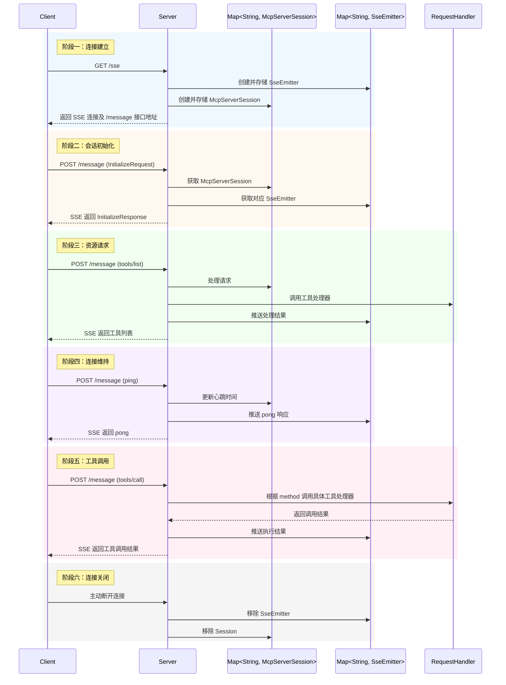

# MCP协议解读：MCP-Server通信原理（SSE）
![[file-20251002111753384.png]]
MCP 协议的核心设计，是围绕「**一个长连接，两类接口**」构建的高效通信模型。本文将结合流程图，带你全面理解 MCP-Server 的通信机制与底层实现。

## 什么是 MCP 的 SSE 通信模型？

MCP 协议在基于 SSE（Server-Sent Events）实现时，可以归纳为：

- **1 个长连接**：客户端通过 SSE 建立服务端到客户端的单向消息流；
- **2 个接口**：
  - `GET /sse`：用于建立长连接并接收服务端消息；
  - `POST /message`：客户端发送请求、响应或通知。

> ✅ **优势**：连接稳定、延迟低、天然支持事件流，适用于 AI 工具类应用中持续会话与异步结果返回等场景。

## 接口详解

### 1. `GET /sse`：建立 SSE 长连接

客户端通过该接口与服务端建立 SSE 连接，服务端创建并关联以下对象：

- `SseEmitter`：用于控制消息推送；
- `McpServerSession`：维护当前会话的上下文状态。

```kotlin
val sessions = ConcurrentHashMap<String, McpServerSession>()  // 会话状态存储
val emitters = ConcurrentHashMap<String, SseEmitter>()         // SSE 连接存储
```

### 2. `POST /message`：客户端主动发消息

支持三种消息类型：
- `Request`：如请求工具列表、调用模型；
- `Response`：客户端对服务端通知的响应；
- `Notification`：客户端状态上报（如心跳 ping）。

## SSE 通信全流程详解

下面的流程图展示了客户端和 MCP-Server 从连接到通信的全过程：
![[file-20251002111753536.png]]



## 实际工作过程总结
1. **连接建立**
    - 客户端请求 `/sse`；
    - 服务端初始化 `SseEmitter` 和 `McpServerSession`，返回可用的消息接口地址。
2. **会话初始化**
    - 客户端通过 `/message` 发送 `InitializeRequest`，告知能力与标识；
    - 服务端处理后通过 SSE 返回 `InitializeResponse`。
3. **资源管理**
    - 客户端发起如 `tools/list` 请求；
    - 服务端从会话中查找状态，调用工具处理器并通过 SSE 返回结果。
4. **调用工具**
    - 客户端拼接 prompt 后发起 `tools/call`；
    - 服务端查找处理器执行逻辑，并通过 SSE 返回执行结果。
5. **连接维持**
    - 客户端周期性发送 `ping`；
    - 服务端返回 `pong`，用于保持连接活跃。
6. **连接关闭**
    - 客户端主动断开；
    - 服务端清理对应的连接与会话状态。

## 总结
从早期的 `stdio` 单机协议演进到 `SSE` 网络协议，是自然的扩展。但在实践中，SSE 仍存在以下问题：
1. 不支持断线重连（缺乏恢复机制）；
2. 服务端需长时间维护高并发连接，资源压力大；
3. 服务端消息只能单向推送，缺乏灵活性。

目前由于 `mcp-java-sdk` 暂未支持新版 `Streamable HTTP` 协议，我们仍采用 SSE 实现。但随着生态演进，**MCP 社区已逐步升级至 `Streamable HTTP` 通信机制**，在下一个版本中，我们也将进行相应迁移，解决当前 SSE 的局限。
