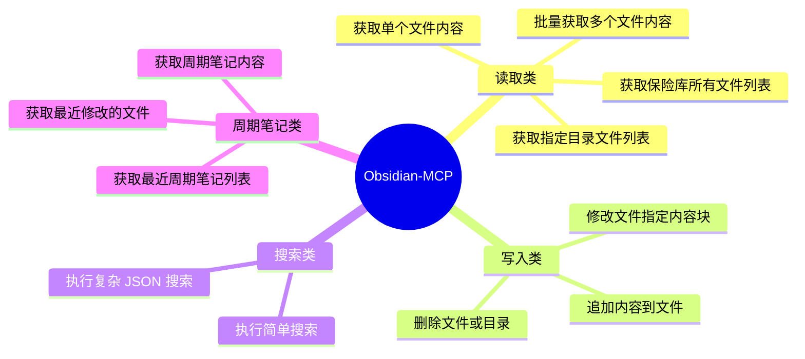

本文实测 Qwen3 系列本地模型（4B/8B/14B）与 Obsidian-MCP 的知识库交互效果，发现小模型存在工具调用失效、响应幻觉及上下文限制等问题。`4B 版本` 因量化丢失指令理解能力，`8B版本` 虽能调用工具但存在内容偏差。`14B+` 就能正常对话了，本地小模型可用性在逐步上升，但我距离流畅交互还差一块 16G 显卡的距离😀
![[file-20251002111756443.png]]

# Qwen3 小模型实测：从 4B 到 30B，到底哪个能用 MCP 和 Obsidian 顺畅对话？
听闻昨晚发布 `qwen3` 优化了模型的 Agent 和 代码能力，进而加强了对 MCP 的支持。

`Qwen3：思深，行速`
https://qwenlm.github.io/zh/blog/qwen3/

引言里面的这句话

```bash
小型MoE模型Qwen3-30B-A3B的激活参数数量是QwQ-32B 10%，表现更胜一筹， 
`Qwen3-4B 这样的小模型也能匹敌 Qwen2.5-72B-Instruct 的性能`。
```

让我很是兴奋了一把，于是下班回去在 `nas服务器` 用 `ollama` pull 模型部署好，使用 `cherry studio`，启用 `obsidian-mcp`，开始测试，测试结果却啪啪打脸。

测试内容：
查询我的 obsidian 知识库最近 1 天的改动，模型瞎回答

> 模型命中不了 tool。

使用 obsidian 的 mcp 的 obsidian_get_recent_changes 工具，查询我的知识库最近 1 天的改动

> 我都提示工具名称了，模型还是瞎回答。

## qwen3 模型

![[file-20251002111756586.png]]

## 模型评测项说明

| 评测名称                       | 说明                           | 解读重点                                              |
| -------------------------- | ---------------------------- | ------------------------------------------------- |
| **ArenaHard**              | 综合对话能力的人工对比评测，偏重 " 困难场景 "    | 高分代表对话生成自然、逻辑性强                                   |
| **AIME'24 / '25**          | 数学竞赛题，测试数学推理、数列、几何等能力        | GPT-4o 分数很低，因其在该基准测试中未开启 " 思考模式 "，Qwen3 表现更实际     |
| **LiveCodeBench**          | 代码生成任务，结合实时代码执行验证正确性         | Qwen3-4B 表现接近 GPT-4o，说明小模型已具备强代码能力                |
| **CodeForces（Elo Rating）** | 类似编程竞赛 Elo 排名，越高越强           | Qwen3-4B > GPT-4o，意味着它在 " 解题速度 + 准确性 " 上优于 GPT-4o |
| **GPQA**                   | 高质量问答集（类似学术类 QA），考察多跳推理      | Qwen 系列保持优势，说明对知识与推理兼顾                            |
| **LiveBench**              | 实时对话任务评测，包括多轮上下文与事实性要求       | GPT-4o 得分较低（52.2），说明未必在所有任务中都最优                   |
| **BFCL**                   | 指令遵循与对话连贯性测试，Qwen 使用 FC 格式评估 | GPT-4o 表现最强，Qwen3-4B 略弱但接近                        |
| **MultiIF（8 Languages）**   | 多语言指令跟随能力评估                  | Qwen3-4B 具有较好多语泛化，优于 GPT-4o（特别在非英语场景）             |

## Obsidian-MCP
**Obsidian-MCP 通常用于以下任务：**
- 日志/笔记内容的语义检索与总结（嵌入 + 问答）
- 自我对话（多轮历史上下文）
- 任务建议、卡片联想等基于上下文的 " 思维增强 "
- 私有知识库的记忆回调（streamable / SSE 模式长连接）
- 本地嵌入 + 轻量推理，不依赖公网 LLM

这些任务主要要求：
- **指令遵循能力**
- **上下文感知（少量上下文）**
- **中等推理能力**
- **响应快，模型小，易部署**

## Obsidian API 工具列表



| 工具方法                      | 功能描述       | 参数                                                |
| ------------------------- | ---------- | ------------------------------------------------- |
| list_files_in_vault       | 获取知识库文件列表  | 无                                                 |
| list_files_in_dir         | 获取指定目录文件列表 | dirpath                                           |
| get_file_contents         | 获取单个文件内容   | filepath                                          |
| get_batch_file_contents   | 批量获取多个文件内容 | filepaths                                         |
| search                    | 执行简单搜索     | query, context_length                             |
| search_json               | 执行格式复杂搜索   | query                                             |
| append_content            | 追加内容到文件    | filepath, content                                 |
| patch_content             | 修改文件指定内容块  | filepath, operation, target_type, target, content |
| delete_file               | 删除文件/目录    | filepath                                          |
| get_periodic_note         | 获取周期笔记内容   | period                                            |
| get_recent_periodic_notes | 获取最近周期笔记列表 | period, limit, include_content                    |
| get_recent_changes        | 获取最近修改的文件  | limit, days                                       |

## 测试 Qwen3-4B 能力是否匹配上述需求
qwen3:4b，吐字飞快，回答的水准也是高了，但是文不对题啊，连要调用 tool 都没识别出来。
于是去看了下 hugging_face 的 [tokenizer_config.json](https://huggingface.co/Qwen/Qwen3-4B/blob/main/tokenizer_config.json) 模型配置,的确有 `tool_call` 这一层啊，咋就不 working，难道是这个 `q4量化` 导致智商减退厉害?
![[file-20251002111756774.png|743x747]]

还以为我 nas 上 4b 的小 n 卡终于派上用场了，看来还得再等等。
想再试试 8b 但是本地显存不够，下面换成 `openrouter` 的服务测试 8b,14b，30b 的。

## 测试 Qwen3-8B 能力是否匹配上述需求
使用 cherryStudio 测试 qwen3:8b，是能够调用 tool，不过回答的有幻觉，返回的笔记名称都改了

```markdown
Qwen3-4B-本地模型 + Obsidian-MCP的`本地问答`.md
回答成了

01Project/Blog/draft/Qwen3-4B-本地模型 + Obsidian-MCP的`本地问题`.md
```

> 这个时候笔记使用 `git 同步` 的优越性就出来了，本地使用 mcp 对笔记进行整理时，如果出现错误，可随时回滚到上次提交的版本！

![[file-20251002111756907.png|743x630]]
那这 8B 基本只能闲聊，在我这个场景属于中看不中用

## 测试 Qwen3-14B 能力是否匹配上述需求
使用 openrouter 的 `qwen3:14b` 模型进行测试

![[file-20251002111757000.png|743x630]]
看着不错，能正常返回结果。
但想深入测试内容却报 token 不足。按官方数据，`qwen3:14b` 模型的最大 token 是 `128K`，15 万字，我想这足够分析一篇笔记了。
但是我测试的时候，让读取笔记内容进行总结，却提示 token 超过 40k 了，不知道为啥？
![[file-20251002111757251.png|743x763]]
从这段报错可以明确看出：
模型当前**上下文限制为**：**40960 tokens**➤ 超限。

判断是 openRouter 自家部署时的限制。换成通义官方的 `qwen3-demo`：

https://huggingface.co/spaces/Qwen/Qwen3-Demo

测试下来同样的文本，是可以正常总结的，128k 的 token 数是足够的，那看来 8B,14B，32B 还是能在本地部署后结合 MCP 派上用场。

## 结论
使用 Qwen3 与 Obsidian-MCP 的知识库交互测试得出结论：

**4B 版本**：量化压缩导致 " 失语 "
- 工具调用能力完全丢失，面对明确的 `obsidian_get_recent_changes` 指令无动于衷
- token 容量 32K，长会话可能难以完整处理

**8B 版本**：看似能用实则危险
- 虽能识别工具调用，但返回的文件路径存在较高的错误率；
- 内容总结时出现 `幻觉改写`，笔记名会被修改；
- 如果 MCP 调用 API 出现误删除，又没有 git 备份会更危险

**14B+ 版本**：真香警告
- 128K token 容量完美适配知识库场景，测试中准确调用 Obsidian API
- 但本地部署需 16G 显存，让多数 NAS 用户望而却步

在我的 16G 显卡到来前，要注意做好隐私保护，先通过云端大模型 +MCP，读取非敏感数据目录作为问答的上下文。

毕竟，做技术的驾驭者，要懂得 `在现实约束中寻找最优解`。

---

**更多延伸阅读，按需探索：**
1️⃣ 想用 OpenRouter 玩转多轮对话？看这篇 👉 [Obsidian+AI 新玩法：免费实现多轮对话与模型自由](https://mp.weixin.qq.com/s/qYIEK7RXfoe-i8HF2WJ3Jw)
2️⃣ 不懂 MCP 协议？快速入门 👉 [MCP 技术解读合集](https://mp.weixin.qq.com/mp/appmsgalbum?__biz=MzA4Nzg2NTY2Mw==&action=getalbum&album_id=3926676657901371394)
3️⃣ 想本地部署 Ollama？一步步带你上手 👉 [NAS+Ollama 打造本地化 DeepSeek 实验室](https://mp.weixin.qq.com/s/5BeFSU09CRf0XOTFrvDOQg)
4️⃣ 没试过 cherryStudio？评测看这里 👉 [AI 大模型 + 本地知识库横评](https://mp.weixin.qq.com/s/o8NDxIBFjhHAJKstEeJlPA)
