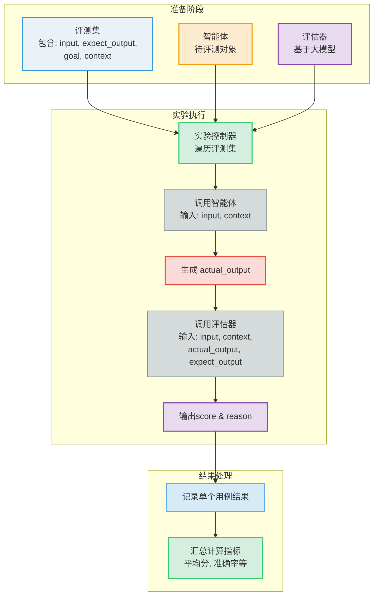

![[file-20251002111759920.jpeg]]
# 如何评测 AI 智能体：试试字节开源的扣子罗盘 CozeLoop
今年智能体如火如荼，上次分享了 [扣子空间开源版coze-studio的评测](https://mp.weixin.qq.com/s/54YRocwnERsqhaO8bZgtWg)，是用于开发智能体的，但真要上线，靠拍脑袋可不行。
机器学习领域早有 ABTest 这一基础设施，是否具备科学实验方法，常常能看出一个团队是不是数据驱动。
而在 AI 时代，传统的评测方式逐渐失效，新的工具就显得格外重要。

字节在 8 月初开源了 **coze-loop**，号称面向 AI 评测的 `罗盘`。我最近部署体验了一番，学习笔记分享给大家。
## coze-loop 的基础概念
* 提示词：与 AI 互动的指令，决定了评测结果的质量和准确性
* 评测集：结构化的表数据，支持自定义数据结构；
* 评测对象：从评测集中选择某些字段作为评测对象；
* 评估器：评估器充当裁判的角色，通过 `量化评测对象` 的输出结果来评估其表现。
* 实验：组合评测集、评测对象、若干评估器三元组，执行评测动作得到实验结果。
* 观测：
	* **Trace**: 一次完整请求的调用链记录。
	* **Span**:  Trace 中的一个独立操作单元，例如一次模型调用，一次函数调用等。
	* **Metadata**: Metadata 是运行过程中的键值对集合，用于存储运行实例的补充信息，例如应用程序版本、运行环境、调用模型或其他需关联的自定义信息。
## coze-loop 的评测逻辑
当我们自己使用 langchain 开发或者 dify 编排的智能体后，需要评估其效果才敢在生产上线，如果没有系统的评测工具来保证正确率，谁也不敢拍板的。
使用预定义的数据集，异步的运行实验，最终通过结果分数来判断抉择；

### 具体实现
1. 大模型管理：只要我们的 agent 的接口 openai compatible 的 completion 接口，都支持评测。
2. 提示词管理：预定义提示词指令，支持变量的配置；
3. 评测集管理：导入表格或手工录入评测集，支持自定义字段，和评估器提示词中的字段进行关联
4. 评估器调试：使用大模型来评估智能体的输出和预期的差异，结果以布尔值或可量化的数值返回
5. 实验执行和对比：实验是通过组合评测集、评测对象、若干评估器三元组，执行评测动作得到实验结果的过程。

最终通过分析实验结果，可以获得有助于业务决策的信息。

### 数据流程
1. 评测集：包含 input、expect_output、goal、context
2. 智能体：提示词包含变量 input，使用评测集的 input 作为输入
3. 评估对象：智能体输出结果 actual_output
4. 评估器：提示词包含变量：input、context、actual_output、expect_output，输出得分和原因
5. 实验：选择智能体、关联评测集、绑定评估器变量、执行实验输出结果指标

实验是一个流程，批量执行评测集里面的多个评测对象，最后生成评测指标。
评测过程，会调用 2 次大模型，1 次执行智能体获取 actual_output，1 次评估智能体的执行结果，

## coze-loop 的物理架构
* 项目地址：[github-coze-loop](https://github.com/coze-dev/coze-loop)
* 官方文档：[what-is-cozeloop](https://loop.coze.cn/open/docs/cozeloop/what-is-cozeloop)

这个物理架构还是蛮重的，运维成本很高。
除了基础的 redis 和 mysql，还依赖 clickhouse，minio，rocketmq3 个集群；

大厂有人有组件就是任性。小团队估计后面 3 个都可以用 mysql 来替代；
不过 coze-loop 产品做的还是蛮完整的，交互设计都很考究，个人使用每个节点都单机也能很快部署起来，大大拉低了用 AI 来做 ABTest 门槛。

![[file-20251002111800070.png]]

## coze-loop 的功能示例
下面是一个机器翻译的例子

### 模型提示词
![[file-20251002111800291.png]]

![[file-20251002111800522.png]]
### 评测集

![[file-20251002111800696.png]]

![[file-20251002111800963.png|1377x968]]

评测集关联的实验
![[file-20251002111801212.png]]

### 评估器
![[file-20251002111801387.png]]

### 实验
![[file-20251002111801513.png]]

![[file-20251002111801697.png]]

![[file-20251002111801830.png]]

### 观测
![[file-20251002111802005.png]]

## 总结
coze-loop 它的架构对小团队来说略显沉重，但其背后的设计思想——**将 AI 应用的开发与严谨的工程评估体系相结合**——是值得我们每一位从业者学习和借鉴的。
在 AI 浪潮中，让效果可量化、可追溯，或许才是走得更远、更稳的关键。
