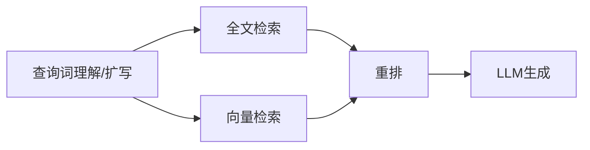
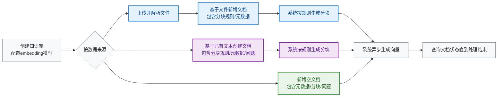
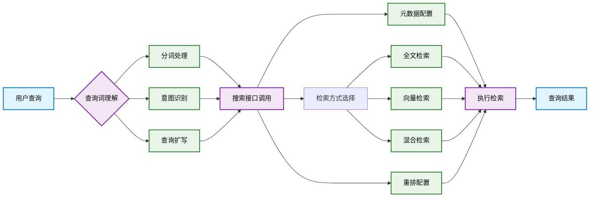
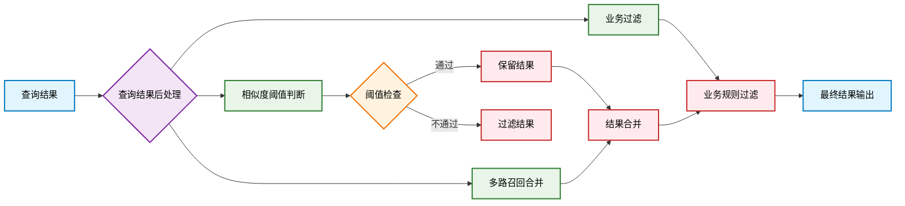

# 深度实战：从选型到避坑，企业 AI 知识库建设分享

你好，我是麦冬。
最近在做了点 AI 知识库建设的技术总结，分享给大家：本文从 `为什么需要知识库` 这个根本问题出发，带你完整走一遍企业 AI 知识库的建设全流程：从技术演进、架构设计、存储选型（为什么我们最终选择了 Elasticsearch？），到索引构建和检索的 API 对接逻辑。最后分享**分块大小、索引更新、召回率与精准度优化**等一系列 `避坑经验`。

## 有大模型了为什么还需要知识库？
1. **时效性要求**：`模型训练集` 的数据通常有截止时间，无法覆盖最新信息。**知识库**可动态更新，能及时纳入法规变动等 **时效性强** 的内容。
2. **专业领域覆盖**：**通用大模型**难以在所有垂直领域达到顶尖水平。构建专门的**领域知识库**，可补足模型在行业实践、内部文档等方面的不足。
3. **推理成本与响应性能**：端到端地用大模型检索与推理，计算资源与延迟成本较高。通过 **RAG** 可显著降低算力消耗和响应时间。
4. **可控性与合规审计**：纯大模型输出 `不可预测`，不能满足企业合规、审计与安全要求。知识库可打标签、授信等级可控，便于审计与异常溯源。
5. **可解释性与用户信任**：模型直出回答缺乏引用，易被质疑。引用知识库提高系统 `可解释性`，增强用户对 AI 建议的信任度。

> 互补而非替代

## 什么是 AI 知识库？
知识库 = 数据库 + 数据内容（原始数据/知识）

| 层级         | 定义             | 关键词    |
| ---------- | -------------- | ------ |
| **数据**     | 原始、无结构的事实记录    | 记录     |
| **知识**     | 规律、推理、建议、结论    | 洞见     |
| **知识库**    | 分类结构化存储的知识集合   | 组织     |
| **AI 知识库** | 引入多模态、语义检索的知识库 | **理解** |

> 数据 -[挖掘]-> 知识 -[组织]->知识库 -[AI]->AI 知识库

财务合规示例

* **数据**：供应商 A 上传发票，金额 ¥120,000
* **知识**：当月超标发票较上月↑20%；行业供应商发票被退回率偏高，建议强化合同审查环节
* **知识库**：高风险供应商名单与处置流程
* **AI 知识库**: 自然语言问答：如何处理超标发票？即时返回合规流程步骤

## AI 知识库的演进
### 2018–2020：向量检索工具箱
2018 年前后，Faiss（Facebook）、Annoy（Spotify）等开源**向量检索库**相继诞生，它们主要被应用在以下几个领域：
1. **人脸识别**：以人脸嵌入向量为基准，实现 1-N 的身份比对，如：安防系统、人脸门禁。
2. **推荐系统**：基于用户和内容的向量表征，实现近似兴趣内容匹配，如：网易云音乐的推荐。
3. **相似图像/视频搜索**：支持图像检索、视频去重等视觉类任务，如：以图搜图。

在这个阶段，向量库仍然是算法人员手中的**工具库**，向量在内存/磁盘文件进行管理，需要人工管理数据导入、索引构建、服务部署等一系列底层流程，门槛较高，产品形态未形成。

### 2020–2022：向量数据库兴起，知识库初具雏形
随着 NLP Transformer 模型的崛起（如 Sentence-BERT），**文本语义向量的质量显著提升**，向量检索开始进入企业应用场景：
1. **Milvus**：2019 年开源，主打高性能向量检索 + 分布式架构，推动 `向量数据库` 概念普及。
2. **Weaviate、Qdrant** 等产品陆续出现，聚焦于 API 接入、混合检索、多租户、水平扩展性等产品能力，推动向量库**产品化落地**。

知识库的雏形开始出现：**将文档切片、向量化后存入向量数据库，通过相似度匹配来实现语义检索。** 但此时它仍处于早期探索阶段，缺乏统一范式。

### 2023–2024：RAG 范式推动向量知识库成标配组件
2023 年，以 ChatGPT 为代表的大语言模型（LLM）爆发，掀起了**RAG** 热潮

> RAG：用向量检索相关知识 → 提供给 LLM 做上下文 → 提升结果准确性

这一范式对向量知识库提出了新的需求：
1. 支持**异构文档的解析与存储**（PDF、网页、Markdown、PPT 等）
2. 能与**Embedding 模型解耦**，支持多模型切换
3. 提供**全文检索 + 向量检索融合（Hybrid Search）** 能力
4. 集成**RAG pipeline**：支持段落分块、召回过滤、重排序

此阶段，`AI知识库`/`向量知识库` 从数据结构演变为**一种智能产品范式**，成为 RAG 应用的关键模块。

### 2025 以后：AI 知识库的三大演进方向
1. **图谱融合：从内容到关系**：不再只是存 `文本向量`，而是结合**实体 + 关系**构建知识图谱，比如 lightGraph 项目
2. **智能体协同：知识库成为 AI 的长时记忆**：知识库参与多轮对话、任务规划，成为智能体的 `记忆中枢`，支持多个智能体（Agent）共享知识、协作完成复杂任务
3. **MCP 架构融合：让知识参与计算与行动**：与智能体的 Memory（记忆）、Computation（计算）、Planning（规划）模块深度整合，支持边查边算、边问边答，实现更强的任务执行能力，让知识库从 `静态查询` 变为 `主动参与` 的智能组件

## 知识库的建设内容
AI 知识库的核心价值：**让组织的知识从 `能查` 变为 `能懂、能问答`**

1. **多模态理解能力**：不仅支持文本，输入还支持图像、语音、表格等多种非结构化数据
2. **语义级组织与检索**：支持语义理解、向量搜索、跨模态问答等 AI 检索方式
3. **企业级服务能力**：租户隔离、分布式水平扩展

> 由 AI 模型驱动的知识管理，是 **RAG** 应用的通用基础设施

### 索引构建主流程

### 索引使用流程

## 知识库的存储选型

> 怎么查决定怎么存

| 检索方式            | 存储方式        | 示例                      |
| --------------- | ----------- | ----------------------- |
| 文件管理（文档、图片、音视频） | 文件系统 / 对象存储 | FTP、OSS、MinIO           |
| 关联查询、结构化字段检索    | 关系型数据库      | MySQL、PostgreSQL        |
| 全文检索、模糊查询       | 文档数据库       | Elasticsearch           |
| 语义检索            | 向量数据库       | Milvus、Faiss、Qdrant、ES8 |
| 高速查找、缓存类信息      | KV 存储       | Redis                   |
| 图检索、路径查询        | 图数据库        | Neo4j、JanusGraph        |

实际企业落地中，AI 知识库通常不是单一技术栈，而是**多种存储 + 检索范式的组合体**，需要满足多场景的检索需求。

### 比较向量知识库的检索方式

|      | Milvus 2.5+            | Weaviate 1.31+        | Qdrant 1.15+    | Elasticsearch 8.13+ |
| ---- | ---------------------- | --------------------- | --------------- | ------------------- |
| 精确查询 | 支持结构化字段过滤              | GraphQL / REST filter | 支持字段级 filter    | Lucene 精确匹配强项       |
| 模糊查询 | 不支持                    | 不支持                   | 不支持             | **支持** Wildcard 查询  |
| 全文检索 | BM25/BGE-M3/SPLADE     | BM25/SPLADE           | BM25/TF-IDF     | BM25/Eleser         |
| 语义搜索 | 强项（HNSW/IVF/DiskANN 等） | 强项（内置嵌入 + 混合检索）       | 强项（嵌入 + 高效 ANN） | DenseVector(HNSW)   |
| 图检索  | 不支持                    | 支持实体 + 关系（轻量知识图谱）     | 不支持             | 弱支持                 |

### 为什么选择 Elasticsearch？

1. **多范式检索**：支持全文、语义、结构化等多种方式，覆盖主流场景。如果有图检索的场景，可以使用 Neo4j 等建立独立的库作为外部索引
2. **生态成熟**：ELK 生态完善，社区活跃，内部团队有相关运维/开发经验。
3. **平滑升级**：目前团队很多产品的检索是基于 ES6 构建，从 ES6 升级到 ES8，DSL 基本可复用，迁移成本低。
4. **查询灵活**：DSL 表达力强，支持复杂组合过滤与排序逻辑，其他库的 DSL 坑较多。
5. **稳健性能**：ES 在性能上略逊于一些极致的向量知识库，但 ES 胜在全面/稳定，能覆盖更广的检索场景。

在向量存储方案上，团队有很多方案（faiss、pgVector、qdrant、Elasticsearch8），现在都逐步切到 `Elasticsearch8` 的 DenseVector。

## 知识库 API 的对接逻辑

### 索引构建流程 - 写

1. **基于文件构建**：适合 `非结构化的文件`（图片/表格/文档），分块算法可自定义（openai-completions 接口协议），如：社保规则库；
2. **基于文本构建**：适合 `结构化程度高的文本`，比如已有大纲的 markdown 笔记；如：运维知识库，个人知识库，17work 的 markdown 笔记；
3. **手动构建**：完全手动控制的精细化处理路径。主要使用平台的向量化存储和检索能力；如：财代 AI 知识库/小二助手（qq-match）；公共数据（text2sql）。

### 知识检索流程 - 读

1. 查询词理解：分词/清理/扩写
2. 调用搜索接口，包含元数据 + 检索方式（全文，; 向量，混搜）+ 重排配置
3. 检索结果后处理：相似度阈值判断，多路召回合并，业务过滤

## 知识库建设避坑
### 分块设置多大合适？

**为什么分块有长度限制？**
1. 会建向量索引，而向量有维度大小（`bge-m3`=1024），输入 token 长度最大支持 8192。
2. 分块的目的是为了检索后，扔给大模型，而大模型有上下文大小的限制，特别是多轮对话场景，如果一轮查出太大，会导致 token 超限。

**分块最长设置多大合适？**
1. `简短文档` 级语义检索: 文档整体编码为一个向量，结合全文索引混合检索；
2. 文档 `语义结构清晰`（如章节、段落）：按结构切分后编码，结合标题/元数据等信息进行过滤；
3. 用于 `精准` RAG 搜索：按业务自定义拆分为多个语义独立的块

> Text Better than Binary

### 如何实时更新分块的向量索引？
使用 `text-embedding-inference` 极速推理框架，提高 embedding 和 rerank 的性能；
1. 单卡 4090，40 并发，1 分钟能 2 万次 embedding，且延时控制在 200ms 以内；
2. 1 个文档 100 个分块，1s 内就能完成向量索引的构建，可做到准实时；

### Exact-KNN VS Approximate-KNN？
1. **Exact KNN（精确搜索）** ：线性遍历比对，确保得到最接近的结果，精度高。但查询耗时随着文档量线性增长，不适合大规模应用；
2. **Approximate KNN（近似搜索）**: 使用 HNSW 加速近似 kNN 检索，构建图结构并只扫描部分候选向量，从而显著提升速度。虽然偶有精准度损失，但对多数应用已足够；

在 Elasticsearch 中，字段类型 `dense_vector` 可以指定为 `flat`（纯精确搜索）或 `hnsw`（近似搜索）。
建议使用 **HNSW** 类型字段，后续也可通过 `script_score` 查询实现精确 kNN，灵活支持两种方式

### HNSW 搜索的 num_candidates 设置多少合适？

**HNSW 搜索特点**
1. **图结构索引**：多层小世界图，分层跳跃式遍历加速搜索
2. **高效近似查找**：构图 `O(n log n)`，查询 `O(log n)`
3. **适配大规模场景**：支持百万级快速检索，用于推荐、搜索等

**HNSW 实践策略**
1. 当候选文档总量**少于约 1 万条**时，精确 KNN 时延仍能接受时，优先保证准确性；
2. 若数据量几十万、几百万以上，精确搜索会变得非常缓慢，这时应优先考虑**HNSW**；
3. **动态设置 `num_candidates`**：平衡性能与召回率：`num_candidates = max(10 × topk, sqrt(filtered_count)).inRange(100, 10000)`

### 召不回（Recall Miss）如何优化？

1. **Query Rewriting（查询重写）**: 注入领域词汇、别名、缩写、拼写变体、常见错误纠正等，如：营改增 → 营业税改增值税
2. **Query Expansion（查询扩展）**: 基于词汇关系对查询进行语义扩展，提升召回广度：
    1. **同义词**：`招聘`<--> `招募`、`录用`
    2. **上位词**（泛化）：如 `Java` -> `编程语言`；**下位词**（细化）：如 `证件` -> `身份证`、`护照`
3. **Hybrid Search（混合检索）**: 结合语义（KNN）与关键词（BM25）匹配，提升召回覆盖率。
4. **Chunk 分块优化**: 控制块大小（如 512 tokens）并适当重叠，保持语义完整性; 避免块过小导致信息碎片化，或块过大导致语义稀释
5. **KNN 图搜索参数**：大数据量动态配置 hnsw 的 num_candidates，小数据量使用精确 KNN

### 召不准（Low Precision）如何优化？

1. **Chunk 元数据信息过滤**: 利用结构化元数据字段进行筛选或排序，提高召回精度：
    1. 如文档类型、标签、创建时间、区域等
    2. 示例：仅检索最近一年内的增值税的政策
2. **Reranking（二阶段排序）**: 在初步召回的基础上，使用精排模型（如 `bge-reranker`）提升相关性
    1. 综合考虑查询语义与候选文本语义进行重新打分
    2. 结合丰富语义线索，如段落标题、编号、来源、摘要等增强 rerank 判别力
3. **Embedding 模型微调**：特定领域的数据集进行二次训练，提升模型在特定场景下的语义理解和表示能力，比如 [biobert](https://github.com/dmis-lab/biobert)

总而言之，AI 知识库是让组织的知识资产从"静态的记录"进化为"可对话的智能体"的核心基础设施。它不仅是今天 RAG 应用的基石，更是未来**AI Agent (智能体)** 实现长时记忆与复杂任务协同的"记忆中枢"。

## 总结

回顾全文，我们能得出几个核心结论：

1. **互补而非替代**：AI 知识库并非要替代大模型，而是通过 **RAG** 范式，将大模型的通用推理能力与企业内部的**动态、专业、可控**知识相结合，实现 1+1>2 的效果。
2. **技术选型是关键**：不存在完美的单一存储方案。类似 **Elasticsearch** 这样支持全文、向量、结构化混合检索的 `多面手`，在当前阶段是兼顾性能、生态与迁移成本的稳健之选。
3. **建设是系统工程**：一个高效的知识库远不止 `存向量` 这么简单。它涵盖了从**文件解析、智能分块**到**混合检索、多路召回与重排序**的完整链路，每个环节都直接影响最终效果。
4. **优化永无止境**：`召不回` 和 `召不准` 是两大常见难题。通过**查询重写、分块优化、Reranking** 等手段持续迭代，才能不断提升知识库的 `智商`。
