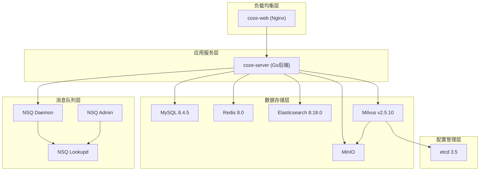

![[file-20251002111805162.png]]
# 深度评测智能体平台 Coze Studio：附部署教程
7 月底字节跳动的 Coze-Studio 正式开源，算是 AI 智能体领域的一个大事件。这个月终于有时间在内网环境进行了部署和评测，希望能为团队的企业知识库和 AI 应用建设提供多一个选项。

其实，我们厂的知识库系统一直是自研的。没有直接采用市面上的开源方案，主要是基于几点考虑：
- **技术栈匹配优先**：知识库属于应用层基础设施，不像 linux/k8s 底层系统那样标准统一。采用团队最熟悉的技术栈，才能保证长期的稳定维护和迭代（比如市面上的智能体大都是基于 python，coze 是基于 go，我们的技术栈是 jvm，就不太适合拿来即用）。
- **可控性至关重要**：作为企业核心设施，我们需要对问题的响应速度和系统的稳定性有绝对把控力，而开源项目的更新节奏和潜在 bug 风险有时难以控制。
- **定制化需求高频**：直接使用开源产品，遇到定制需求时需要开分支修改，很难合并回 master 分支，后续的二次开发和升级成本非常高。

`Coze` 的开源版本让我能以更低的成本体验一个大厂能展现的功能完整的智能体平台。以下把我的评测和部署记录分享给大家。

## 个人评测
### 值得称赞的亮点
1. **智能体功能完整**：平台整体设计成熟，涵盖了智能体开发所需的大部分核心功能，超出了我们对一个初开源项目的预期，与 maxkb，dify 相比个人觉得更灵活，更有特点。
2. **文件解析体验佳**：知识库的文件解析模块支持分块内容和原文预览的对照查看，对于调试和优化分块效果非常友好。
### 有待改进的细节
1. **模型管理略显原始**：缺乏图形化的大模型管理模块，仍需在后台通过修改 YAML 配置文件来接入新模型，这对运维不够友好。
2. **分块策略不够灵活**：目前支持固定长度、分隔符和按段落拆分，但缺少自定义分段策略（如通过 Webhook 接入）。实际业务中的文档结构复杂，简单规则往往难以理想分割。
3. **缺少开箱即用的 Chat 界面**：智能体发布后，仅能通过 API/SDK 集成，不提供可嵌入的前端聊天界面。相比之下，Dify、MaxKB 等项目都提供了这一功能，便于快速集成。
4. **提示词优化功能缺失**：提示词管理目前全靠手动编写和调试。如果能集成类似 `prompt-optimizer` 这样的开源优化工具，会极大提升创建效率。

## Coze Studio 的功能说明
### 智能体
![[file-20251002111805388.png]]

![[file-20251002111805580.png]]

平台的核心，功能设计得非常周全：

- **自定义插件**：目前并非基于标准的 Model Context Protocol（MCP），未来若能接入 MCP 生态，扩展性会更强。
- **工作流编排**：界面清爽，调试方便，易于构建复杂逻辑。
- **知识库集成**：智能体可直接读写知识库，增强回答能力。
- **记忆与状态**：通过变量和数据库管理对话状态和用户记忆。
- **用户体验优化**：支持设置开场白、对话建议、快捷指令和背景图片，细节到位。

### 知识库
支持三种类型的知识库，适应不同场景：
1. **表格知识库**：导入 Excel 文件，生成结构化数据。
2. **文本知识库**：支持 PDF、DOCX 等格式，通过分块建立向量索引。
3. **图片知识库**：导入图片，支持人工标注或智能打标。

### 提示词管理
支持 Markdown 格式的可视化编辑，并可将调试好的提示词保存到库中，方便团队复用。

### 数据库
这是一个亮眼功能，Coze 支持低代码方式操作数据库。用户可在界面定义 MySQL 表结构，智能体便能直接对其进行读写，相当于内置了一个 `text2sql` 方案。
![[file-20251002111805753.png|2549x612]]

在智能体中将数据库表作为记忆
![[file-20251002111805891.png]]

## Coze Studio 的物理架构

Coze Studio 的物理架构图，展示各个部署角色之间的关系。



![[file-20251002111806073.png]]
### 前端服务层
- **coze-web**: Nginx 反向代理服务器，处理静态资源和请求转发

### 应用服务层
- **coze-server**: Go 后端服务，基于 Hertz 框架，提供 API 接口和业务逻辑

### 数据存储层
- **MySQL**: 主数据库，存储业务数据
- **Redis**: 缓存服务
- **Elasticsearch**: 搜索引擎，支持 SmartCN 分析器
- **Milvus**: 向量数据库，用于存储嵌入向量
- **MinIO**: 对象存储服务

### 消息队列层
- **NSQ**: 分布式消息队列系统，包含 lookupd、nsqd 和 admin 组件

### 配置管理层
- **etcd**: 分布式配置管理和服务发现

## Coze Studio 的部署说明

docker-compose 部署的文件列表

```bash
➜  coze git:(master) ✗ tree -L 3
.
├── backend
│   └── conf
│       ├── model
│       ├── plugin
│       └── prompt
├── nginx
│   ├── conf.d
│   │   └── default.conf
│   ├── ssl
│   └── nginx.conf
├── volumes
│   ├── elasticsearch
│   │   ├── es_index_schema
│   │   ├── analysis-smartcn.zip
│   │   ├── elasticsearch.yml
│   │   └── setup_es.sh
│   ├── etcd
│   │   └── etcd.conf.yml
│   ├── minio
│   │   ├── default_icon
│   │   └── official_plugin_icon
│   ├── mysql
│   │   ├── schema.sql
│   │   └── sql_init.sql
│   └── rocketmq
│       └── broker.conf
├── docker-compose.yml
├── example.env.env
└── readme.md
```

> 备注：elasticsearch，kafka，mysql 这几个服务我之前有部署，所以没有包括在 docker-compose 里面部署

### docker-compose 配置
minio 和 coze-server 是用 coze-web(nginx) 代理的，具体见 nginx/default.conf

```yml
name: coze-studio
x-env-file: &env_file
  - coze.env

services:
  redis:
    image: bitnami/redis:8.0
    container_name: coze-redis
    restart: always
    user: root
    privileged: true
    env_file: *env_file
    environment:
      - REDIS_AOF_ENABLED=${REDIS_AOF_ENABLED:-no}
      - REDIS_PORT_NUMBER=${REDIS_PORT_NUMBER:-6379}
      - REDIS_IO_THREADS=${REDIS_IO_THREADS:-4}
      - ALLOW_EMPTY_PASSWORD=${ALLOW_EMPTY_PASSWORD:-yes}
    ports:
      - '6379'
    volumes:
      - ./data/bitnami/redis:/bitnami/redis/data:rw,Z
    command: >
      bash -c "
        /opt/bitnami/scripts/redis/setup.sh
        # Set proper permissions for data directories
        chown -R redis:redis /bitnami/redis/data
        chmod g+s /bitnami/redis/data

        exec /opt/bitnami/scripts/redis/entrypoint.sh /opt/bitnami/scripts/redis/run.sh
      "
    healthcheck:
      test: ['CMD', 'redis-cli', 'ping']
      interval: 5s
      timeout: 10s
      retries: 10
      start_period: 10s
    networks:
      - coze-network

  minio:
    image: minio/minio:RELEASE.2025-07-23T15-54-02Z
    container_name: coze-minio
    user: root
    privileged: true
    restart: always
    env_file: *env_file
    ports:
      - '9000'
      - '9001'
    volumes:
      - ./data/minio:/data
      - ./volumes/minio/default_icon/:/default_icon
      - ./volumes/minio/official_plugin_icon/:/official_plugin_icon
    environment:
      MINIO_ROOT_USER: ${MINIO_ROOT_USER:-minioadmin}
      MINIO_ROOT_PASSWORD: ${MINIO_ROOT_PASSWORD:-minioadmin123}
      MINIO_DEFAULT_BUCKETS: ${MINIO_BUCKET:-opencoze},${MINIO_DEFAULT_BUCKETS:-milvus}
    entrypoint:
      - /bin/sh
      - -c
      - |
        # Run initialization in background
        (
          # Wait for MinIO to be ready
          until (/usr/bin/mc alias set localminio http://localhost:9000 $${MINIO_ROOT_USER} $${MINIO_ROOT_PASSWORD}) do
            echo "Waiting for MinIO to be ready..."
            sleep 1
          done

          # Create bucket and copy files
          /usr/bin/mc mb --ignore-existing localminio/$${STORAGE_BUCKET}
          /usr/bin/mc cp --recursive /default_icon/ localminio/$${STORAGE_BUCKET}/default_icon/
          /usr/bin/mc cp --recursive /official_plugin_icon/ localminio/$${STORAGE_BUCKET}/official_plugin_icon/

          echo "MinIO initialization complete."
        ) &

        # Start minio server in foreground
        exec minio server /data --console-address ":9001"
    healthcheck:
      test:
        [
          'CMD-SHELL',
          '/usr/bin/mc alias set health_check http://localhost:9000 ${MINIO_ROOT_USER} ${MINIO_ROOT_PASSWORD} && /usr/bin/mc ready health_check',
        ]
      interval: 30s
      timeout: 10s
      retries: 3
      start_period: 30s
    networks:
      - coze-network

  etcd:
    image: bitnami/etcd:3.5
    container_name: coze-etcd
    user: root
    restart: always
    privileged: true
    env_file: *env_file
    environment:
      - ETCD_AUTO_COMPACTION_MODE=revision
      - ETCD_AUTO_COMPACTION_RETENTION=1000
      - ETCD_QUOTA_BACKEND_BYTES=4294967296
      - ALLOW_NONE_AUTHENTICATION=yes
    ports:
      - '2379'
      - '2380'
    volumes:
      - ./data/bitnami/etcd:/bitnami/etcd:rw,Z
      - ./volumes/etcd/etcd.conf.yml:/opt/bitnami/etcd/conf/etcd.conf.yml:ro,Z
    command: >
      bash -c "
        /opt/bitnami/scripts/etcd/setup.sh
        # Set proper permissions for data and config directories
        chown -R etcd:etcd /bitnami/etcd
        chmod g+s /bitnami/etcd

        exec /opt/bitnami/scripts/etcd/entrypoint.sh /opt/bitnami/scripts/etcd/run.sh
      "
    healthcheck:
      test: ['CMD', 'etcdctl', 'endpoint', 'health']
      interval: 5s
      timeout: 10s
      retries: 10
      start_period: 10s
    networks:
      - coze-network

# milvusdb/milvus:v2.5.10
  milvus:
    container_name: coze-milvus
    image: milvusdb/milvus:2.2.0-20230427-9286d7a4
    user: root
    privileged: true
    restart: always
    env_file: *env_file
    command: >
      bash -c "
        # Set proper permissions for data directories
        chown -R root:root /var/lib/milvus
        chmod g+s /var/lib/milvus

        exec milvus run standalone
      "
    security_opt:
      - seccomp:unconfined
    environment:
      ETCD_ENDPOINTS: etcd:2379
      MINIO_ADDRESS: minio:9000
      MINIO_BUCKET_NAME: ${MINIO_BUCKET:-milvus}
      MINIO_ACCESS_KEY_ID: ${MINIO_ROOT_USER:-minioadmin}
      MINIO_SECRET_ACCESS_KEY: ${MINIO_ROOT_PASSWORD:-minioadmin123}
      MINIO_USE_SSL: false
      LOG_LEVEL: debug
    volumes:
      - ./data/milvus:/var/lib/milvus:rw,Z
    healthcheck:
      test: ['CMD', 'curl', '-f', 'http://localhost:9091/healthz']
      interval: 5s
      timeout: 10s
      retries: 10
      start_period: 10s
    ports:
      - '19530'
      - '9091'
    depends_on:
      etcd:
        condition: service_healthy
      minio:
        condition: service_healthy
    networks:
      - coze-network

  coze-server:
    image: cozedev/coze-studio-server:0.3.11
    restart: always
    container_name: coze-server
    env_file: *env_file
    # environment:
    #   LISTEN_ADDR: 0.0.0.0:8888
    networks:
      - coze-network
    ports:
      - '8888'
      - '8889'
    volumes:
      - .env:/app/.env
      - ./backend/conf:/app/resources/conf
      # - ../backend/static:/app/resources/static
    depends_on:
      minio:
        condition: service_healthy
      milvus:
        condition: service_healthy
    command: ['/app/opencoze']

  coze-web:
    image: cozedev/coze-studio-web:0.0.1
    container_name: coze-web
    restart: always
    ports:
      - "${WEB_LISTEN_ADDR:-9081}:80"
      # - "443:443"  # SSL port (uncomment if using SSL)
    volumes:
      - ./nginx/nginx.conf:/etc/nginx/nginx.conf:ro  # Main nginx config
      - ./nginx/conf.d/default.conf:/etc/nginx/conf.d/default.conf:ro  # Proxy config
      # - ./nginx/ssl:/etc/nginx/ssl:ro  # SSL certificates (uncomment if using SSL)
    depends_on:
      - coze-server
    networks:
      - coze-network

networks:
  coze-network:
    driver: bridge
```

### 环境变量配置

```bash
# Server
export LISTEN_ADDR=":8888"
export LOG_LEVEL="debug"
export MAX_REQUEST_BODY_SIZE=1073741824
export SERVER_HOST="http://localhost${LISTEN_ADDR}"
export USE_SSL="0"
export SSL_CERT_FILE=""
export SSL_KEY_FILE=""
export WEB_LISTEN_ADDR="0.0.0.0:9081"

# MySQL
export MYSQL_DATABASE=opencoze
export MYSQL_USER=coze
export MYSQL_PASSWORD=xxx
export MYSQL_HOST=192.168.68.11
export MYSQL_PORT=3306
export MYSQL_DSN="${MYSQL_USER}:${MYSQL_PASSWORD}@tcp(${MYSQL_HOST}:${MYSQL_PORT})/${MYSQL_DATABASE}?charset=utf8mb4&parseTime=True"
export ATLAS_URL="mysql://${MYSQL_USER}:${MYSQL_PASSWORD}@${MYSQL_HOST}:${MYSQL_PORT}/${MYSQL_DATABASE}?charset=utf8mb4&parseTime=True"

# Redis
export REDIS_AOF_ENABLED=no
export REDIS_IO_THREADS=4
export ALLOW_EMPTY_PASSWORD=yes
export REDIS_ADDR="redis:6379"
export REDIS_PASSWORD=""

# This Upload component used in Agent / workflow File/Image With LLM  , support the component of imagex / storage
export FILE_UPLOAD_COMPONENT_TYPE="storage"

# Storage component
export STORAGE_TYPE="minio" # minio / tos / s3
export STORAGE_UPLOAD_HTTP_SCHEME="http" # http / https. If coze studio website is https, you must set it to https
export STORAGE_BUCKET="opencoze"
# MiniIO
export MINIO_ROOT_USER=minioadmin
export MINIO_ROOT_PASSWORD=minioadmin123
export MINIO_DEFAULT_BUCKETS=milvus
export MINIO_AK=$MINIO_ROOT_USER
export MINIO_SK=$MINIO_ROOT_PASSWORD
export MINIO_ENDPOINT="minio:9000"
export MINIO_API_HOST="http://${MINIO_ENDPOINT}"

# Elasticsearch
export ES_ADDR="http://192.168.68.12:9200"
export ES_VERSION="v8"
export ES_USERNAME="elastic"
export ES_PASSWORD="xxx"

export COZE_MQ_TYPE="kafka" # nsq / kafka / rmq
export MQ_NAME_SERVER="192.168.68.13:9092"
# RocketMQ
export RMQ_ACCESS_KEY=""
export RMQ_SECRET_KEY=""

# Settings for VectorStore
# VectorStore type: milvus / vikingdb
# If you want to use vikingdb, you need to set up the vikingdb configuration.
export VECTOR_STORE_TYPE="milvus"
# milvus vector store
export MILVUS_ADDR="milvus:19530"
export MILVUS_USER=""
export MILVUS_PASSWORD=""

# Settings for Embedding
export EMBEDDING_TYPE="http"
export EMBEDDING_MAX_BATCH_SIZE=100

# http embedding
export HTTP_EMBEDDING_ADDR=""   # (string, required) http embedding address
export HTTP_EMBEDDING_DIMS=1024 # (string, required) http embedding dimensions

# Settings for OCR
export OCR_TYPE="ve"
# ve ocr
export VE_OCR_AK=""
export VE_OCR_SK=""
# paddleocr ocr
export PADDLEOCR_OCR_API_URL=""

# Settings for Document Parser
# Supported parser types: `builtin`, `paddleocr`
export PARSER_TYPE="builtin"
# paddleocr structure
export PADDLEOCR_STRUCTURE_API_URL=""

# Settings for Model
# Model for agent & workflow
# add suffix number to add different models
export MODEL_PROTOCOL_0="ark"       # protocol
export MODEL_OPENCOZE_ID_0="100001" # id for record
export MODEL_NAME_0=""              # model name for show
export MODEL_ID_0=""                # model name for connection
export MODEL_API_KEY_0=""           # model api key
export MODEL_BASE_URL_0=""           # model base url

# Model for knowledge nl2sql, messages2query (rewrite), image annotation, workflow knowledge recall
export BUILTIN_CM_TYPE="ark"
# type openai
export BUILTIN_CM_OPENAI_BASE_URL=""
export BUILTIN_CM_OPENAI_API_KEY=""
export BUILTIN_CM_OPENAI_BY_AZURE=false
export BUILTIN_CM_OPENAI_MODEL=""

# type ark
export BUILTIN_CM_ARK_API_KEY=""
export BUILTIN_CM_ARK_MODEL=""
export BUILTIN_CM_ARK_BASE_URL=""

# type deepseek
export BUILTIN_CM_DEEPSEEK_BASE_URL=""
export BUILTIN_CM_DEEPSEEK_API_KEY=""
export BUILTIN_CM_DEEPSEEK_MODEL=""

# Workflow Code Runner Configuration
# Supported code runner types: sandbox / local
# Default using local
# - sandbox: execute python code in a sandboxed env with deno + pyodide
# - local: using venv, no env isolation
export CODE_RUNNER_TYPE="local"
# Sandbox sub configuration
# Access restricted to specific environment variables, split with comma, e.g. "PATH,USERNAME"
export CODE_RUNNER_ALLOW_ENV=""
# Read access restricted to specific paths, split with comma, e.g. "/tmp,./data"
export CODE_RUNNER_ALLOW_READ=""
# Write access restricted to specific paths, split with comma, e.g. "/tmp,./data"
export CODE_RUNNER_ALLOW_WRITE=""
# Subprocess execution restricted to specific commands, split with comma, e.g. "python,git"
export CODE_RUNNER_ALLOW_RUN=""
# Network access restricted to specific domains/IPs, split with comma, e.g. "api.test.com,api.test.org:8080"
# The following CDN supports downloading the packages required for pyodide to run Python code. Sandbox may not work properly if removed.
export CODE_RUNNER_ALLOW_NET="cdn.jsdelivr.net"
# Foreign Function Interface access to specific libraries, split with comma, e.g. "/usr/lib/libm.so"
export CODE_RUNNER_ALLOW_FFI=""
# Directory for deno modules, default using pwd. e.g. "/tmp/path/node_modules"
export CODE_RUNNER_NODE_MODULES_DIR=""
# Code execution timeout, default 60 seconds. e.g. "2.56"
export CODE_RUNNER_TIMEOUT_SECONDS=""
# Code execution memory limit, default 100MB. e.g. "256"
export CODE_RUNNER_MEMORY_LIMIT_MB=""

# The function of registration controller
# If you want to disable the registration feature, set DISABLE_USER_REGISTRATION to true. You can then control allowed registrations via a whitelist with ALLOW_REGISTRATION_EMAIL.
export DISABLE_USER_REGISTRATION="" # default "", if you want to disable, set to true
export ALLOW_REGISTRATION_EMAIL=""  #  is a list of email addresses, separated by ",". Example: "11@example.com,22@example.com"

# Plugin AES secret.
# PLUGIN_AES_AUTH_SECRET is the secret of used to encrypt plugin authorization payload.
# The size of secret must be 16, 24 or 32 bytes.
export PLUGIN_AES_AUTH_SECRET='^*6x3hdu2nc%-p38'
# PLUGIN_AES_STATE_SECRET is the secret of used to encrypt oauth state.
# The size of secret must be 16, 24 or 32 bytes.
export PLUGIN_AES_STATE_SECRET='osj^kfhsd*(z!sno'
# PLUGIN_AES_OAUTH_TOKEN_SECRET is the secret of used to encrypt oauth refresh token and access token.
# The size of secret must be 16, 24 or 32 bytes.
export PLUGIN_AES_OAUTH_TOKEN_SECRET='cn+$PJ(HhJ[5d*z9'
```

### 大模型配置
从 backend/conf/model/template 里面复制一个

```bash
cp backend/conf/model/template/model_template_deepseek.yaml backend/conf/model/template/deepseek.yaml
```

修改的配置项目

```yml
meta:
    protocol: deepseek
    capability:
        function_call: true
    conn_config:
        base_url: "https://api.deepseek.com/v1"
        api_key: "sk-xxx"
        model: "deepseek-chat"
```

### MySQL 初始化

```sql
# 建库
CREATE DATABASE opencoze DEFAULT CHARACTER SET utf8mb4  DEFAULT COLLATE utf8mb4_bin;
CREATE USER 'coze'@'%' IDENTIFIED BY 'xxx';
grant all privileges on opencoze.* to coze@'%' IDENTIFIED BY 'xxx';
flush privileges;
```

执行 `volumes/mysql/schema.sql` 初始化表结构
执行 `volumes/mysql/sql_init.sql` 初始化示例数据
### ES 索引初始化
es_index_schema：
https://github.com/coze-dev/coze-studio/tree/e7070b419c5e1a5f3cb789f4433b84ab7cf43519/docker/volumes/elasticsearch/es_index_schema

由于我使用已有的模型，将内置的 analyzer，由 `smartcn` 改为 `ik_analyzer`

```bash
# 新增模板
PUT _index_template/coze_resource_template
{
  "index_patterns": ["coze_resource*"],
  "template": {
    "settings": {
      "number_of_shards": 1,
      "number_of_replicas": 0,
      "analysis": {
        "analyzer": {
          "text_analyzer": {
            "type": "custom",
            "tokenizer": "standard",
            "filter": ["lowercase", "stop", "snowball"]
          }
        }
      }
    },
    "mappings": {
      "dynamic": false,
      "properties": {
        "res_type": { "type": "keyword" },
        "app_id": { "type": "keyword", "null_value": "NULL" },
        "res_id": { "type": "keyword" },
        "res_sub_type": { "type": "keyword" },
        "name": {
          "type": "text",
          "analyzer": "ik_max_word",
          "search_analyzer": "ik_smart",
          "fields": { "raw": { "type": "keyword" } }
        },
        "owner_id": { "type": "keyword" },
        "space_id": { "type": "keyword" },
        "biz_status": { "type": "keyword" },
        "publish_status": { "type": "keyword" },
        "create_time": { "type": "long" },
        "update_time": { "type": "long" },
        "publish_time": { "type": "long" }
      }
    }
  },
  "priority": 200,
  "_meta": {
    "description": "resource library's index template"
  }
}

PUT _index_template/project_draft_template
{
  "index_patterns": ["project_draft*"],
  "template": {
    "settings": {
      "number_of_shards": 1,
      "number_of_replicas": 0,
      "analysis": {
        "analyzer": {
          "text_analyzer": {
            "type": "custom",
            "tokenizer": "standard",
            "filter": ["lowercase", "stop", "snowball"]
          }
        }
      }
    },
    "mappings": {
      "dynamic": false,
      "properties": {
        "create_time": {
          "type": "long"
        },
        "has_published": {
          "type": "keyword"
        },
        "id": {
          "type": "keyword"
        },
        "name": {
          "type": "text",
          "analyzer": "ik_max_word",
          "search_analyzer": "ik_smart",
          "fields": {
            "raw": {
              "type": "keyword"
            }
          }
        },
        "owner_id": {
          "type": "keyword"
        },
        "publish_time": {
          "type": "long"
        },
        "space_id": {
          "type": "keyword"
        },
        "status": {
          "type": "keyword"
        },
        "type": {
          "type": "keyword"
        },
        "update_time": {
          "type": "long"
        },
        "fav_time": {
          "type": "long"
        },
        "recently_open_time": {
          "type": "long"
        },
        "is_fav": {
          "type": "keyword"
        },
        "is_recently_open": {
          "type": "keyword"
        }
      }
    }
  },
  "priority": 200,
  "_meta": {
    "description": "Project draft index template"
  }
}

# 新增索引
PUT /project_draft
PUT /coze_resource
```

### 其他
1. 主页登录失败，发现是 bucket 问题，检查 minio 部署情况
2. minio 是启动自动创建 bucket 的，无需初始化
3. docker ps 可以看到 bridge 暴露的动态端口，可以动态端口进入 minio-ui 查看数据
4. 最终主页地址：http://localhost:9081

## 总结

Coze-Studio 开源版的发布展示了字节在 AI 工程化方面的强大实力，其功能完整性令人印象深刻，为业内提供了一个高起点的智能体开发平台。

对于技术团队而言，它是一个绝佳的**学习和参考项目**。但在决定是否用于生产前，仍需仔细评估其与自身业务需求的匹配度，以及潜在的二次开发与运维成本。是否顺手，还需要亲手试一试才知道。
