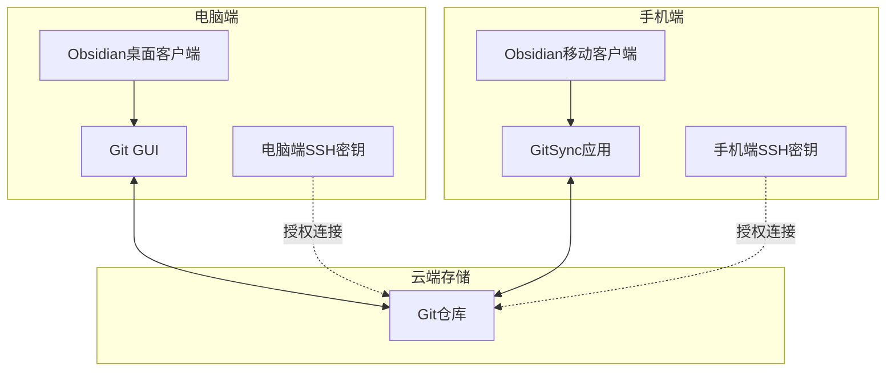
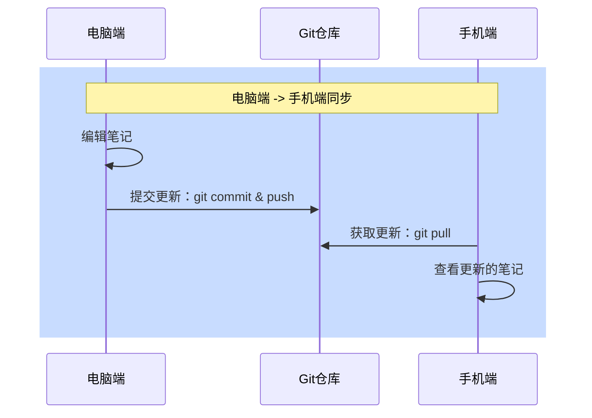
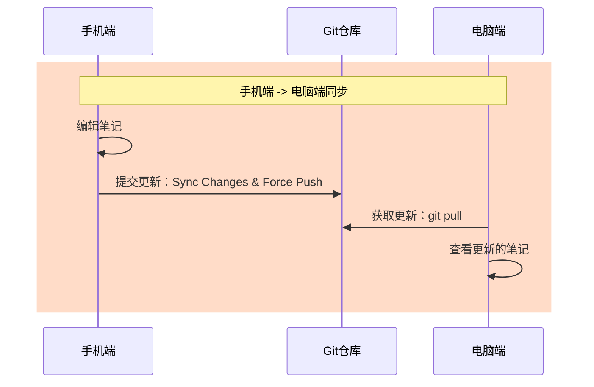

![[file-20251002111821900.jpeg]]
本文围绕 Obsidian 与 Git 的无痛结合，解读多端同步的核心价值，逐步剖析同步方案、实操流程与最佳实践，让零基础用户也能快速搭建手机与电脑间的实时笔记同步系统，保障数据安全与版本可控，讲解版本控制优势、冲突回滚策略，提供实用模板与建议，助你高效管理笔记。

# Obsidian 新手必看：用 Git 搭建多端同步知识库，极速更新＋安全回滚

## 同步需求

- 手机端能随时记录闪念，并同步到服务器
- 电脑端能及时获取手机更新
- 发生冲突时，能及时提示并友好解决
- 同步故障时，可快速回滚到上一个稳定版本
- 同步服务性能稳定，不占用过多手机资源

---

## 同步方案



## 为什么推荐 Git 方案
最核心的理由是因为**我要打造 AI 知识库!!**

当我使用 AI 对我的笔记进行自动整理，打标时，我需要
1. 确认对本地每个文件的改动情况，
2. 有改动异常的随时撤销当前改动。

这个特性 `Git版本控制系统` 天然具备，且是其他存储服务都不具备的。

另外 Git 比多数网盘，云存储，p2p 工具（如 Syncthing）更稳定、更透明，且支持完整版本管理。

- **更安心**：每次笔记更新都会生成一份历史快照，想回退随时回退，不怕误操作。
- **更自由**：数据掌握在自己手里，不依赖第三方服务器，跨设备自由同步。
- **更耐用**：Git 是全球开发者用来管理代码的标准工具，成熟稳定，长期可用。
- **更省心**：一次配置，长期使用。无局域网限制，外网同步更简单。

## 操作流程
1. git 服务器：注册登录，初始化项目
2. 电脑端：初始化 sshKey
3. git 服务器：配置 ssh public key
4. 电脑端
	1. git 项目下载到本地
	2. 安装 obsidian 客户端，配置 vault 为 git 目录
	3. obsidian 安装 git 插件
	4. 测试同步：电脑端 -->git 服务器
5. 手机端
	1. 安装 git 客户端 -GitSync，配置 sshKey
	2. 测试同步：git 服务器 -->手机端
	3. 安装 obsidian 客户端，选择 git 目录作为 vault 目录
	4. 测试同步：手机端 -->git 服务器
 
### 同步流程：电脑端 --> 安卓端



### 同步流程：手机端 --> 电脑端



---

## 配置教程
### Git 服务
- 登录 git 云服务: [https://gitee.com/](https://gitee.com/)（可用 `微信` 授权登录）
- 初始化 `note` 项目
- 配置安卓端和电脑端的 publicKey

![[file-20251002111822200.mp4]]

> Git 平台一般支持 5G 左右的免费空间，配置好密钥后无需再登录

---

### 电脑端
- Windows-Git GUI: [https://git-scm.com/downloads/win](https://git-scm.com/downloads/win)
- SSH 密钥准备：publicKey, privateKey
- Obsidian 客户端: [https://obsidian.md/download](https://obsidian.md/download)
- Obsidian 客户端安装 obsidian-git 插件

![[file-20251002111822557.mp4]]
windows-git bash 初始化 ssh key

```bash
# 配置你的ssh-key的目录，一般为用户目录下的.ssh目录
mkdir -p  /c/Users/Administrator/.ssh/
ssh-keygen -t rsa -N '' -f /c/Users/Administrator/.ssh/id_rsa

# 配置你的用户名
git config --global user.name '极客工具' 
# 配置你的提交邮箱
git config --global user.email 'xtool@gmail.com'
```

### 安卓端
- GitSync 客户端：[https://gitsync.viscouspotenti.al](https://gitsync.viscouspotenti.al)
- SSH 密钥准备：publicKey, privateKey
- Git 项目配置
- Obsidian 客户端: [https://obsidian.md/download](https://obsidian.md/download)

![[file-20251002111822910.mp4]]

> 注意：手机端需要在 obsidian 的 git 插件设置中配置 `diable on this device`

---

## 实践建议：双库结构

1. **主 vault（vault-kbase）**：
   - 用于个人知识库存储
   - 使用 `PARA` 方法论组织目录

2. **手机同步 vault（vault-mobile）**：
   - 用于手机端闪念采集、稍后阅读、剪藏
   - 库小轻量，定期整理归档到 kbase 库

---

## 项目资源

懒人开箱即用的 obsidian 模板（包含所需安装包）：

- GitHub：[https://github.com/geosmart/obsidian-template](https://github.com/geosmart/obsidian-template)
- 国内地址：[https://gitee.com/geosmart/obsidian-template](https://gitee.com/geosmart/obsidian-template)

> 遇到问题可在公众号留言或在项目提 issue

## 结语
通过 Obsidian + Git 的组合，你不仅拥有了零基础可复制的多端同步系统，还能享受 `版本控制` 带来的安全与灵活。
无论是日常灵感捕捉，还是打造 `个人AI知识库`，Git 历史快照、冲突回滚、跨设备无缝衔接，都让你的笔记管理更高效、更安心。
动手 10 分钟，就能让 Obsidian 再无同步烦恼，快来试试！

---

**更多延伸阅读，按需探索：**
1. 搞好了同步，闪念笔记走起 👉 [零延迟捕捉灵感！Markor + 微信语音 + Obsidian 手机端笔记三步攻略](https://mp.weixin.qq.com/s/VOuxZiNc-F-oYHntIdbP-w)
2. 习惯使用 termux 执行 git 同步？看这篇 👉 [Obsidian 多端同步 - Git+Termux](https://mp.weixin.qq.com/s/JOy_hmy1dIKd2C6U4joz4Q)
3. 想用 ssh 远程控制手机执行 git 更新 👉 [使用 frp 实现任意地点远程控制 Android 手机](https://mp.weixin.qq.com/s/KpjEaRO8dTRBksOsAwJpSw)
