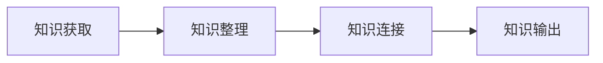

![[01Project/Blog/content/assets/kbase-ingestion-reading/kbase-ai-ingestion-区域擦除操作 _1_ _1_-20250302.png|1024x576]]

# 构建智能知识库 - 知识获取：Obsidian Web Clipper 的 AI 自动化流程
本文重点讲解知识获取阶段的 `AI实践`。通过 `Obsidian Web Clipper` 和 `DeepSeek` 平台，实现自动提取 `文章标签`、`智能总结关键点`、`生成价值评价` 等功能。
文章提供了详细的实践指南，包括插件下载、基础配置、解释器配置等步骤，以及 Android 移动端的实操示例。

知识库建设分 4 个阶段（`知识获取`->知识整理 ->知识连接 ->知识输出）。



我们知识获取阶段用哪些工具，如何使用 AI 来提效？

## 提取内容
我们收藏一篇文章稍后阅读，起码需要了解以下内容才能支撑我们制作一张卡片笔记。

1. 一句话总结 + 关键点提取
2. 生成评价，突出其价值和适用场景
3. 提取文章标签：限定领域的标签，比如软件开发

在没有 AI 之前，我们可能需要通读过后才能得出结论，但现在收藏后立刻就能提取上面的信息。

## 实践指南
### 插件下载
obsidian web clipper 是浏览器插件的形式。
插件安装：[下载地址](https://obsidian.md/clipper)，支持 chrome，firefox，edge，safri 等主流浏览器。

### 基础配置
1. 新建模板配置用来将网页保存为 markdown。这里比较重要的几个设置包括笔记存放的 `vault` 和 `文件夹`
2. 新增一个 `未归档` 的 `标签`，这样在 obsidian 里面可以按未归档来查询整理

### 解释器配置
#### 什么是解释器
解释器是一个为 obsidian web clipper 的专门设计的功能，允许用户使用自然语言与网页交互。解释器帮助用户捕获和修改采集的内容并保存到 Obsidian。例如：
1. 提取特定文本片段。
2. 总结或解释信息。
3. 将文本翻译成另一种语言。

> 本质上这是一个 RAG 程序，上下文是解释器用于处理提示的页面，上下文越小，解释器运行越快。

#### 解释器模型配置
1. 在 DeepSeek 官网开通 [DeepSeek-api服务](https://platform.deepseek.com/api_keys)，创建 1 个 API key
2. 在 `Obsidian Web Clipper` 插件配置页，添加模型供应商，添加 `DeepSeek` 模型;

![[01Project/Blog/content/assets/kbase-ingestion-reading/local-kbase-ai-image-20250302-1.png|852x705]]

### 采集内容配置
配置解释器，定制提示词，采集时生成摘要

> 建议配置 2 个模板，1 个启用 AI，1 个不启用

![[01Project/Blog/content/assets/kbase-ingestion-reading/local-kbase-ai-image-20250302-2.png|998x858]]

解释器上下文使用默认即可，采集特定的网站可以定制 html 选择器，减少 token 消耗

> 笔记内容配置

```bash
未归档,{{"3个标签,逗号分隔"}}

# {{"本文的中文标题"}}
{{"本文的中文摘要，1句话提取核心内容，以及3个关键点,用有序列表展示"}}
{{"本文的简短评价，突出其价值和适用场景"}}

---

{{content}}
```

## 移动端
我使用的是 android 系统，安装好 obsidian 和 firefox 浏览器，然后火狐浏览器开启账号同步，在 obsidian clipper 中导入配置

> 导入电脑上的配置

![[01Project/Blog/content/assets/kbase-ingestion-reading/Screenshot_20250302_163825_org.mozilla.firefox.jpg]]

![[01Project/Blog/content/assets/kbase-ingestion-reading/Screenshot_20250302_164017_org.mozilla.firefox.jpg]]

> 文章高亮示例

![[01Project/Blog/content/assets/kbase-ingestion-reading/Screenshot_20250302_172835_org.mozilla.firefox.jpg]]

> 采集示例

![[01Project/Blog/content/assets/kbase-ingestion-reading/Screenshot_20250302_175013_org.mozilla.firefox.jpg]]

点击添加到 Obsidian，markdown 会自动存储到 vault 对应的目录。
手机端检测到文件更新后，liveSync 插件会自动同步，然后就可以进入知识整理阶段了。

---

📌 总结
本文聚焦知识库建设最关键的 `知识获取` 阶段，介绍如何使用 Obsidian 官方的 `Obsidian Web Clipper` 来实现数据采集和 AI 智能提取。
之前分享过使用 [miniflux rss 阅读](https://mp.weixin.qq.com/s/eGIwReEwZMshuulsPJHEYw) 来定制自己的阅读源，我们在使用 miniflux 阅读时，也可以直接用 `Obsidian Web Clipper` 进行剪藏。
