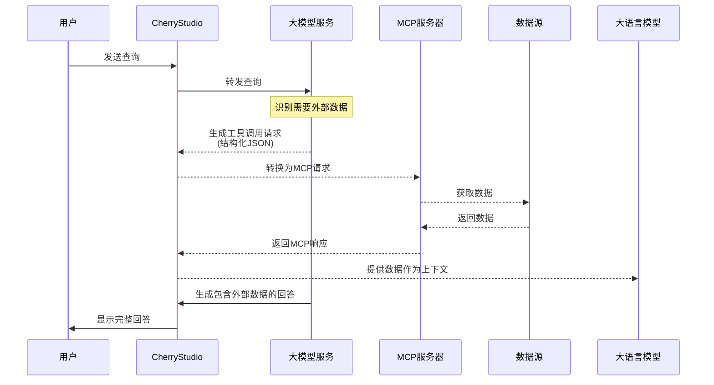
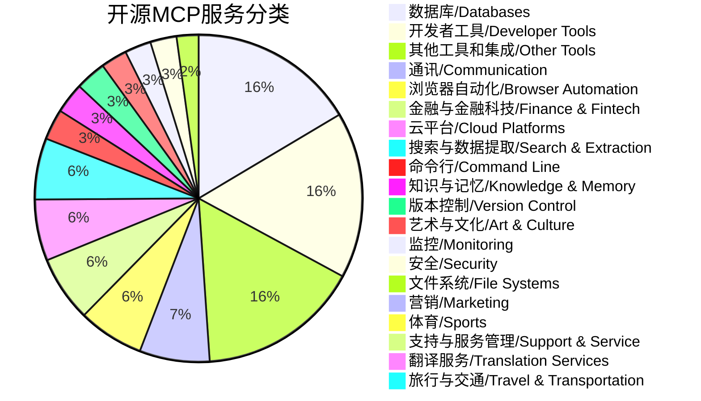
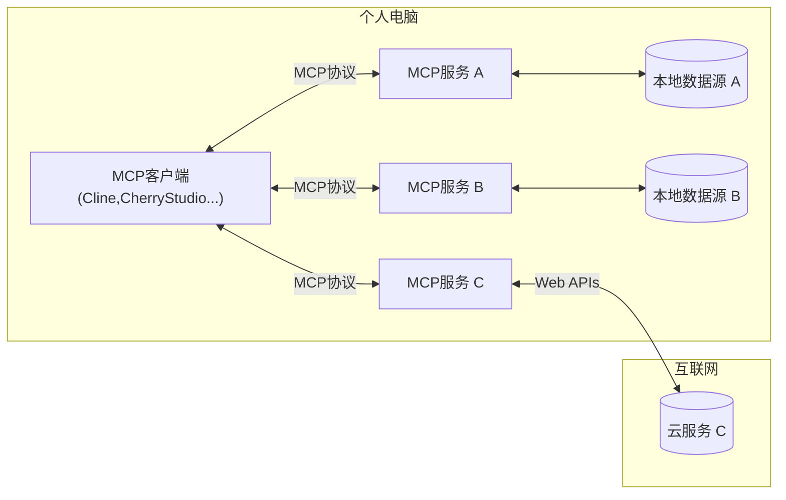
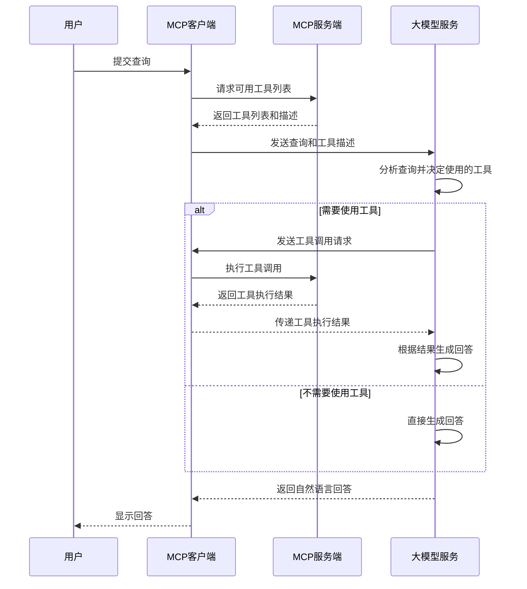

![[大模型MCP技术解读-image-20250402.png|1024x436]]
MCP（Model Context Protocol）是一种让 LLM 应用无缝连接外部数据的协议，工作在应用层而非模型层，像 AI 界的 " 万能 Type-C 接口 "。它支持资源、工具、提示词等能力，不依赖模型原生工具调用，已有 247+ 开源实现。本文详解 MCP 原理、分类及交互流程。

# 模型无关的 AI 集成革命：MCP 协议解读
![[mcp.jpg|791x132]]
Model Context Protocol (MCP) 是**一种实现 LLM 应用程序与外部数据源无缝集成的协议**
无论您是在构建一个 AI 驱动的集成开发环境、增强聊天界面，还是创建定制的 AI 工作流程，MCP 都提供了一种标准化的方式来连接 LLMs 与所需的上下文。

## MCP 和 Tool 的关系
MCP 与传统的大模型 Tool 调用存在本质区别，MCP 是一种让 AI 应用能够与外部数据源和工具进行交互的协议，而不是直接在 AI 模型层面实现的功能。
这一点非常重要，因为 `MCP工作在应用层而非模型层`。

### 如何判断模型是否支持 Tool？
在 huggingface 里面查看模型的 tokenizer_config.json，分析有 added_tokens_decoder 里面没有 `<tool_call>`，chat_template 里面有没有 `if tool` 的逻辑

### 模型支持 Tool 是如何训练的？
训练支持工具调用的模型需三步：
1. **编教材**：构造带工具说明书和模拟调用流程的对话数据（用户提问→模型调工具→返回结果→总结答案）；
2. **改格式**：用 XML 标签（如 `<tool_call>`）框住结构化数据，并在词表添加特殊标记；
3. **分阶段练**：先基础对话，再混合工具案例训练，最后用强化学习纠正输出格式。
模型最终学会「先查工具再回答」的流程。

## 为什么 CherryStudio 中要求支持 tool 的大模型才能使用 Mcp Server?
Cherry Studio 选择了依赖工具调用的实现路径，这不是 MCP 标准本身的限制。
Cherry Studio 通过模型的工具调用能力来直接从模型请求中提取 MCP 指令，这需要模型能够结构化地输出工具调用请求。
![[MCP 技术概揽-Screenshot from 2025-04-02 08-14-34-20250402.png|1074x860]]
其他 MCP 实现可以采用不同方式：
1. 应用层解析 - 客户端应用可以分析模型输出中的文本，识别出潜在的数据请求
2. 中间件拦截 - 在模型输出到用户前，中间件可以拦截并处理 MCP 请求
3. 提示工程 - 通过特定格式指导模型表达数据需求

CherryStudio 的 MCP 交互流程



## 主流的开源 MCP 服务
### MCP 站点
* 官方 mcp-server: https://github.com/modelcontextprotocol/servers
* 开源 awesome-mcp-servers: https://github.com/punkpeye/awesome-mcp-servers
* pulse-mcp: https://pulsemcp.com
* glam-mcp: https://glama.ai/mcp/servers
* mcp.so: https://mcp.so/
* 阿里云百炼-MCP广场： https://bailian.console.aliyun.com/?tab=mcp#/mcp-market

### MCP 分类
截至 2025 年 4 月 2 日,awesome-mcp-servers 上的开源 mcp 服务有 247 个，最大分类为数据库和开发者工具并列最多（各 38 个，占比 15.4%）



## MCP 提供的能力
MCP 服务器可以提供 3 种主要类型的功能：
1. **Resources**：客户端可以读取的类似文件的数据（例如 API 响应或文件内容）
2. **Tools**：可由 LLM 调用的函数（需经用户批准）
3. **Prompts**：预先编写的模板，帮助用户完成特定任务
4. Sampling：启用服务器的 AI 生成能力（ sampling creation ）
5. Roots：列出服务器有权访问的客户端文件系统根节点（暴露目录和文件）
MCP Server 可以提供 1 种或者多种类型的功能。

基于 [awesome-mcp-servers](https://github.com/punkpeye/awesome-mcp-servers) 的组件分析，
1. Tool 占比较大，一个原因是 Tool 全自动使用无需人工介入配置，易用性强，另外一个原因是 C 端已积累了大量的开源 function call 工具，MCP 流行后，都迁移过来了；
2. Resources 和 Prompt 更倾向于 B 端场景，目前企业接入较少，估计未来也会变多，目前我所在的企业就要做一个 Resources 类的 MCP 研发；

| 客户端                      | Resources | Prompts | Tools | Sampling | Roots | 备注                      |
| ------------------------ | --------- | ------- | ----- | -------- | ----- | ----------------------- |
| fast-agent               | ✅         | ✅       | ✅     | ✅        | ✅     | **唯一全支持多模态 MCP**，含端到端测试 |
| Claude Desktop App       | ✅         | ✅       | ✅     | ❌        | ❌     | 完整支持 MCP 核心功能           |
| Continue                 | ✅         | ✅       | ✅     | ❌        | ❌     | 完整支持 MCP 核心功能           |
| Daydreams Agents         | ✅         | ✅       | ✅     | ❌        | ❌     | 支持服务器无缝接入代理             |
| Cline                    | ✅         | ❌       | ✅     | ❌        | ❌     | 支持工具和资源管理               |
| Copilot-MCP              | ✅         | ❌       | ✅     | ❌        | ❌     | 支持工具和资源管理               |
| Roo Code                 | ✅         | ❌       | ✅     | ❌        | ❌     | 支持工具和资源管理               |
| Sourcegraph Cody         | ✅         | ❌       | ❌     | ❌        | ❌     | 仅通过 OpenCTX 支持资源        |
| oterm                    | ❌         | ✅       | ✅     | ❌        | ❌     | 支持工具和提示词                |
| Claude Code              | ❌         | ✅       | ✅     | ❌        | ❌     | 支持提示词和工具                |
| Genkit                   | ⚠️        | ✅       | ✅     | ❌        | ❌     | 通过工具实现资源列表/查询           |
| Zed                      | ❌         | ✅       | ❌     | ❌        | ❌     | 提示词以斜杠命令形式呈现            |
| **以下仅支持工具**              |           |         |       |          |       |                         |
| 5ire                     | ❌         | ❌       | ✅     | ❌        | ❌     | 基础工具支持                  |
| BeeAI Framework          | ❌         | ❌       | ✅     | ❌        | ❌     | 代理工作流中工具支持              |
| Cursor                   | ❌         | ❌       | ✅     | ❌        | ❌     | 基础工具支持                  |
| Emacs Mcp                | ❌         | ❌       | ✅     | ❌        | ❌     | Emacs 环境工具集成            |
| LibreChat                | ❌         | ❌       | ✅     | ❌        | ❌     | 代理工具支持                  |
| mcp-agent                | ❌         | ❌       | ✅     | ⚠️       | ❌     | 含服务器连接管理和代理工作流          |
| Microsoft Copilot Studio | ❌         | ❌       | ✅     | ❌        | ❌     | 基础工具支持                  |
| Superinterface           | ❌         | ❌       | ✅     | ❌        | ❌     | 基础工具支持                  |
| TheiaAI/TheiaIDE         | ❌         | ❌       | ✅     | ❌        | ❌     | Theia 环境代理工具支持          |
| Windsurf Editor          | ❌         | ❌       | ✅     | ❌        | ❌     | 协作开发 AI Flow 工具支持       |
| Witsy                    | ❌         | ❌       | ✅     | ❌        | ❌     | Witsy 平台工具支持            |
| SpinAI                   | ❌         | ❌       | ✅     | ❌        | ❌     | TypeScript 代理工具支持       |
| OpenSumi                 | ❌         | ❌       | ✅     | ❌        | ❌     | OpenSumi 环境工具支持         |
| Apify MCP Tester         | ❌         | ❌       | ✅     | ❌        | ❌     | 测试专用工具支持                |

**关键观察**：
1. `fast-agent` 是唯一支持全部 5 项功能的客户端
2. 核心功能（资源/提示词/工具）全支持的有 4 个客户端
3. 超半数客户端（17/25）仅支持工具功能
4. 采样和根节点功能普及率最低，仅 1 个客户端支持

sampling 和 Roots 支持的 client 比较少，暂具体介绍下 3 类能力的功能

### Resource 资源
Resource 是模型上下文协议（MCP）的核心基本元素，允许服务器暴露数据内容，这些内容可以被客户端读取，并用作 LLM 交互的上下文。

#### 资源类型
可以包括：
* 文件内容
* 数据库记录
* API 响应
* 实时系统数据
* 截图和图片
* 日志文件

每个资源都通过一个唯一的 URI 进行标识，可以包含文本或二进制数据。

#### 资源 URI
资源使用遵循此格式的 URI 进行标识：

```bash
[protocol]://[host]/[path]
```

例如：
* `file:///home/user/documents/report.pdf`
* `postgres://database/customers/schema`
* `screen://localhost/display1`

协议和路径结构由 MCP 服务器实现定义。服务器可以定义自己的自定义 URI 方案。

### Tools 工具
工具是模型上下文协议（MCP）中的强大原语，它使服务器能够向客户端暴露可执行功能。通过工具，LLMs 可以与外部系统交互，执行计算并在现实世界中采取行动。

工具被设计为 **模型控制** ，这意味着工具从服务器暴露给客户端，目的是让 AI 模型能够自动调用它们（由人工在环中批准）。

#### Tool 的接口
MCP 中的工具允许服务器向客户端暴露可调用的可执行函数，LLMs 可以使用这些函数执行操作。工具的关键方面包括：
* **功能发现** ：客户端可以通过 `tools/list` 端点列出可用的工具
* **功能调用** ：工具通过 `tools/call` 端点被调用，服务器执行请求的操作并返回结果
* **灵活性** ：工具可以是从简单的计算到复杂的 API 交互

与 [资源](https://modelcontextprotocol.io/docs/concepts/resources) 类似，工具通过唯一的名称进行标识，并且可以包含描述以指导其使用。然而，与资源不同，工具代表动态操作，可以修改状态或与外部系统交互。

#### Tool 的定义

```typescript
{
  name: string;          // Unique identifier for the tool
  description?: string;  // Human-readable description
  inputSchema: {         // JSON Schema for the tool's parameters
    type: "object",
    properties: { … }  // Tool-specific parameters
  }
}
```

### Prompts 提示词
Prompts 使服务器能够定义可重用的提示模板和工作流程，客户端可以轻松地将其呈现给用户，并 LLMs。它们提供了一种强大的方式来标准化和共享常见的 LLM 交互。

#### Prompts 类型
* 接受动态参数
* 包含 resource 的上下文
* 链接多个交互
* 指导特定的工作流程
* 以 UI 元素（如斜杠命令）呈现

#### 提示结构
每个提示都由以下定义：

```typescript
{
  name: string;              // Unique identifier for the prompt
  description?: string;      // Human-readable description
  arguments?: [              // Optional list of arguments
    {
      name: string;          // Argument identifier
      description?: string;  // Argument description
      required?: boolean;    // Whether argument is required
    }
  ]
}
```

## MCP 的系统组成



开发一个 MCP 服务需要关注 3 点
1. MCP 服务端：提供 MCP 服务接口
2. MCP 客户端：连接到 MCP 服务，提供工具描述和列出可用的 tool
3. MCP 协议：客户端和服务端的通信协议，支持 stdio/sse，均使用**JSON-RPC 2.0**消息类型交换数据。

## MCP 客户端 - 服务端交互流程



MCP 客户端和服务端的交互流程
1. 用户向客户端提交查询
2. 客户端从服务端获取可用工具列表和描述
3. 客户端将查询和工具描述发送给 LLM
4. LLM 分析查询并决定是否需要使用工具
5. 如果需要使用工具：
    1. LLM 向客户端发送工具调用请求
    2. 客户端通过服务端执行工具
    3. 服务端返回执行结果
    4. 结果传回 LLM
    5. LLM 基于结果生成回答
6. 如果不需要使用工具，LLM 直接生成回答
7. 最终回答通过客户端显示给用户

## 结语
如果你正在折腾 AI 应用集成，MCP 这个协议绝对值得关注。它就像给大模型装了个万能接口，什么数据都能接，用起来比传统工具调用灵活多了。
最近在做这方面的研发，下期会分享下如何自己手搓一个 MCP 并在 Cline 中集成。
