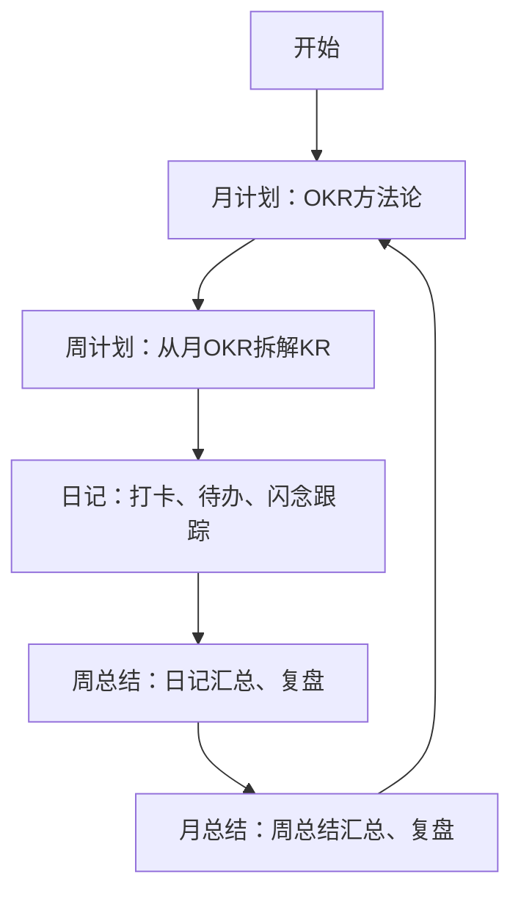

![[file-20250411084900.png]]
如何用工程师思维实现高效目标管理？本文揭秘基于 OKR 方法论与 Obsidian 的月总结自动化流程，通过拆解关键结果、闪念捕捉、数据视图联动，实现从日记录到月复盘的全链路追踪，让个人成长可视化、可量化、可持续迭代。

# 轻松做好月总结：OKR + Obsidian 自动化工作流
之前分析了 obsidian 里面的 [日记工作流: 待办、闪念与打卡](https://mp.weixin.qq.com/s/QUYjIP2NtatjrB_-mPIVXA) 和 [周总结自动化: PDCA循环实践](https://mp.weixin.qq.com/s/VuuMaA73jeNYHaD-X1toCw)。
月计划有 30 天可以计划，和周计划，日记相比，更大的时间跨度会给我们勇气，迸发出更大的想象空间，这期分享下我的月总结方法。
有了 OKR + Obsidian 自动化工作流，不需要再硬撑着写了，日拱一卒，周有复盘，月有方向，模板生成，高效前进。

## 工作流
很多年之前看过一本书 `《软技能：代码之外的生存指南》`，里面谈到一个有趣的视角对我当时的认知挺有触动：
把自己当作一个企业去思考，把雇主当作是你的软件开发企业的一个客户，这种 `诠释雇佣关系的方式` 可以将你从 `仰人鼻息` 的弱势地位转化成为 `自我治理` 和自我引导的主动地位。

我的工作,生活,学习现在完全依赖 obsidian 运转已经过了 2 年，月计划，日跟踪，周复盘，整理输出都在 obsidian 中进行，现在整理分享固化，便于持续优化迭代流程。
![[file-20250411075348.jpg]]



日>周>月逐层做好输入，每层使用自动化方法，汇总或统计，为下一层提供数据支撑，小步快跑渐进迭代达成目标。

**工作流程**
1. **制定月计划**：使用 `OKR` 方法论，包含工作，学习，运动，一切皆可 OKR；
2. **制定周计划**：结合月计划，安排本周重要事项，要达成的 KR；
3. **日记**：每日打卡，GDD 闪念笔记，待办跟踪；
4. **周总结**：按标签分类 `汇总日记` 中的待办，GDD 闪念笔记，打卡记录；复盘完成情况和提升之处；
5. **月总结**：汇总统计本月的周总结的数据，复盘完成情况和提升之处；
6. 重新执行第 1 步，开始下一个**PDCA 循环**

这个流程在企业里面也是这么管理团队的，对于我个人的生活管理来说，也完全适用；

## 工具
这个流程涉及以下 obsidian 插件：
1. 周期记录：[periodic-notes](obsidian://show-plugin?id=periodic-notes)
2. 笔记模板：[templater-obsidian](obsidian://show-plugin?id=templater-obsidian)
3. 闪念捕捉: [quikadd](obsidian://show-plugin?id=quickadd)
4. 数据视图：[dataview](obsidian://show-plugin?id=dataview)
5. 图表视图：[obsidian-chartsview-plugin](obsidian://show-plugin?id=obsidian-chartsview-plugin)

## 月总结中的自动化
### 周总结
当前月总结文件（2025-03.md）对应的周报，放在 Diary/2025/Weekly 目录，格式为 2025-W13.md，13 是周序号，使用 `period-notes` 按模板生成。
周总结使用 `dataviewjs` 汇总当月的周总结文件列表，可以 hover 上去查看/编辑。
![[file-20250411072748.png]]

### Memos-GDD 统计
使用 `dataviewjs` 实现了 2 个按钮，按标签统计这个月的闪念笔记

#### Memos-GDD 统计
读取 Diary/[年份]/Weekly 内多个周总结文件，
解析出标签 #good, #difficult, #different 的次数，并分组汇总；
点击按钮时，生成 chartsview 的 v 饼状图数据，插入到当前文件的 ${config.gddSectionTitle} 章节内
![[file-20250411072802.png]]

#### Memos- 标签统计
读取 Diary/[年份]/Weekly 内多个周总结文件，
解析出 ## Memos 章节内标签，并分组汇总；
点击按钮时，生成 chartsview 的柱状图 数据，插入到当前文件的 ${config.memoSectionTitle} 章节内

![[file-20250411072722.jpg]]

## 月总结模板

```markdown
使用 OKR 制定月度目标和关键结果，按照 PDCA 循环（日/周/月总结）落地执行
## 月度计划

> 使用**OKR**，定目标和关键结果,注意要符合**SMART**原则，关键结果需包含**可验证的完成标准**（如 " 方案输出 " 需明确交付物形态/通过评审）

1. 工作计划：产品上线/方案输出
2. 输入目标：精读 1 本书输出 3 篇笔记
3. 输出目标：写作 10 篇（知识管理/自媒体工具），整理 n 个领域的笔记
4. 健康管理：运动 n 次，户外 n 次
5. 社交关系：家庭会议 n 次，社交活动 n 次

## 周总结
> 当前月总结文件（2025-03.md）对应的周报，放在 Diary/2025/Weekly 目录，格式为 2025-W13.md，13是周序号

## 数据统计
> Memos-GDD统计
>读取 Diary/[年份]/Weekly 内多个周总结文件，
>解析出标签 #good, #difficult, #different 的次数，并分组汇总；
>点击按钮时，生成 chartsview 数据，插入到当前文件的 ${config.gddSectionTitle} 章节内

> Memos-标签统计
>读取 Diary/[年份]/Weekly 内多个周总结文件，
>解析出 ## Memos 章节内标签，并分组汇总；
>点击按钮时，生成 chartsview 的柱状图 数据，插入到当前文件的 ${config.memoSectionTitle} 章节内


### GDD 统计
> 点击按钮`Memos-GDD统计`生成

### 标签统计
> 点击按钮`Memos-标签统计`生成

## 行动复盘
> check: 使用 obsidian 的数据视图，按周汇总目标执行的关键结果

## 目标复盘
> 根据行动情况，结合月度计划，行动复盘内的KR完成情况，手动总结目标完成情况

## 策略复盘
> 对目标完成情况，按**GDD**复盘做的好的和不好的，可以做哪些改进调整，为下个阅读提供参考
```

## 结语
工具只是载体，真正关键的是把企业级管理思维迁移到个人成长中，这样我们每个人都是自己人生的 CEO 了。
看完这篇，你可能已经跃跃欲试想打开 Obsidian 了，正好又到周五，周末正是做周总结的好时机，现在动手，下周一的你会感谢此刻的自己✨
欢迎在评论区晒出你的月总结方法论，我们互相抄作业呀~
