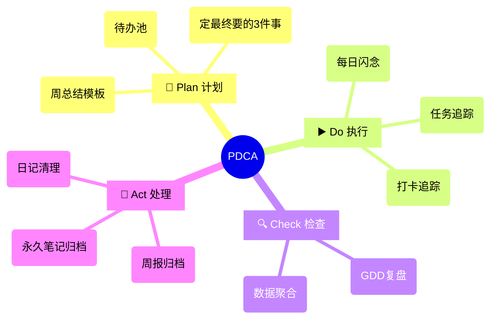

![[obsidian-gtd-weekly-image-20250323-4.png|872x371]]
每周用 10 分钟完成深度复盘？这套基于 PDCA 循环的 Obsidian 周总结工作流，通过 dataview 脚本自动聚合日记中的 GDG 思考和待办数据，生成可视化周报后自动归档原始日记。告别 3650 个散落文件，用自动化实现知识沉淀，让每周成长清晰可见。

# 轻松做好周总结：PDCA 循环 + Obsidian 自动化工作流
## 周报 VS 周总结
一提到写 `周报` 大家都会有点紧张有压力，感觉是要写点什么给上级汇报，表明自己没摸鱼。
但是 `周总结` 这个词却没有这种感觉，当把视角从 `证明价值` 转为 `创造价值`，周报便不再是向上表演的苦差了。

总结是一个自我驱动的词，是一个自我对话的契机，我的周总结不局限于工作汇报，个人工作/项目的执行情况，习惯养成情况，身体/心理的能量状态，也在记录和总结范畴；

之前分享了 [Obsidian写日记的方法](https://mp.weixin.qq.com/s/QUYjIP2NtatjrB_-mPIVXA)，很多朋友问：每天写那么多零散的日记，到年底会不会变成几千个找不到的碎片？
今天就来分享我的解决方案——用 `PDCA 循环 + Obsidian自动化脚本`，每周 10 分钟把 7 天碎片变系统总结。

## 方法论：当 PDCA 遇上 Obsidian

在个人知识管理中，**周总结是连接碎片化记录与系统化复盘的关键枢纽**。我将其拆解为 PDCA 四步闭环：
1. **Plan**：每周一用模板生成计划框架，基于代办池（inbox.md）,确定本周的重要的 3 件事;
2. **Do**：每日记录 GDG 思考（Good/Difficult/Different）+ Task 任务执行情况；
3. **Check**：周六用脚本聚合本周的日记数据，复盘哪些做的好，哪些任务存在阻碍，如何推进。
4. **Act**：漫游将本周日记中关联的笔记，提取卡片，形成永久笔记，删除原始日记避免信息过载；

这套 PDCA 的妙处在于**把抽象的管理方法论变成可 Ctrl+C/V 的操作指南**。

当你在 Obsidian 中：
1. 按下 `Ctrl+P` 调出命令面板
2. 输入 weekly，按模板一键「生成周报」；
3. 制定 1 周计划；
4. 一周结束后，看着自动填充的 GDG 思考和一周待办

你会真切感受到：真正的效率工具不是替代思考，而是让有价值的思考自然浮现。就像老农用自动灌溉系统解放双手，才有时间思考作物的生长规律。

因为周总结可能会在一周的最后 2 天或者下一周的第 1 天做，所以我设计了 2 组按钮（GDD 聚合，Task 聚合）；
点击按钮即即可一键聚合，脚本会自动覆盖已经生成的数据；

![[obsidian-gtd-weekly-image-20250323-3.png|608x622]]

做个小调查，啥时候需要的同学超过 500，我就把模板整理后开源。

## 工具准备

### 基础工具
1. **Periodic Notes**：自动生成周/日记框架
2. **Tasks**：任务生命周期管理
   `✅ 天然支持任务进度追踪：已完成/未完成/推迟`
   `📊 原生视图统计：按标签/日期/优先级分组`
3. **Templater**：提供日，周，月，季，年，阅读，会议等基础模板框架

### 核心工具 - DataviewJS
与普通 Dataview 的区别：
1. 能动态执行 JS 代码，处理自定义的数据分组和排序；
2. 实时文件操作，生成聚合内容；

### 我的三个关键应用场景

1. GDG 闪念笔记聚合：自动提取本周所有 `#good/#difficulet/#different` 三个标签内容，然后按 gdd 三个维度分组，按时间排序
2. tasks 待办内容聚合：我在日记里记录待办的时候，会给他打上标签（比如说项目名，事物，编码，工具之类），然后就可以自动提取本周所有的待办，按待办的标签分组，按时间排序，
3. 物理聚合归档：此处使用 DataviewJS 聚合数据写入周总结，而非视图形式。

> GDD 明细：使用 AI 生成的演示数据

![[obsidian-gtd-weekly-image-20250323-1.png|812x812]]

> Task 明细：使用 AI 生成的演示数据

![[obsidian-gtd-weekly-image-20250323-2.png|811x967]]

### 为什么选择物理聚合归档而非视图？
我在实战中发现两种模式的差异：

| 模式       | 动态视图     | 物理聚合      |
| -------- | -------- | --------- |
| **数据存储** | 依赖原始文件   | 生成独立文件    |
| **检索效率** | 随文件量增加变慢 | 恒定时间复杂度   |
| **知识图谱** | 节点爆炸式增长  | 关键节点精准连接  |
| **迁移成本** | 需完整环境    | 单文件带走全部信息 |

在聚合归档过程中，可以：
1. **噪声过滤**：删除重复/临时性记录
2. **模式识别**：发现任务耗时规律（如每周四效率低谷）
3. **知识固化**：将可复用的思考沉淀为方法文档

# 周总结的视频演示
写周报很容易陷入罗列这一周干了啥，而缺乏总结思考，最后变成流水帐。
Obsidian 的自动汇总可以帮我自动汇总这些本周工作内容，这样我的精力就解放出来了，有时间去贯彻 PDCA。

下面按 PDCA 循环来演示我的一周工作流。
1. Plan：使用 `period notes`，创建 obsidian 周模板，做周计划
2. Do：用 `cline + deepseek` 生成了 1 周的日记模拟数据；
3. Check：汇总数据，复盘总结，识别差距原因
4. Action：将有效方案固化，若未达成，启动新循环，调整计划/执行方法；
![[obsidian-pdca-weekly.mp4]]

## 最后的小建议

刚开始不用追求完美，我从手写总结到现在的自动化汇总也是用了 1 年时间。
重要的不是工具多高级，而是养成记录的习惯，有了每天的日记输出，周总结水到渠成。
