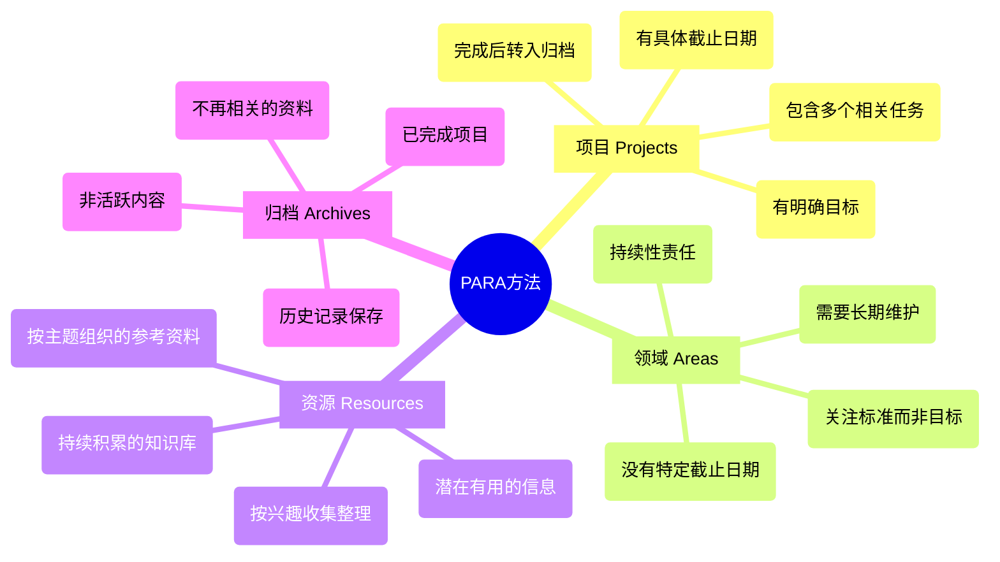
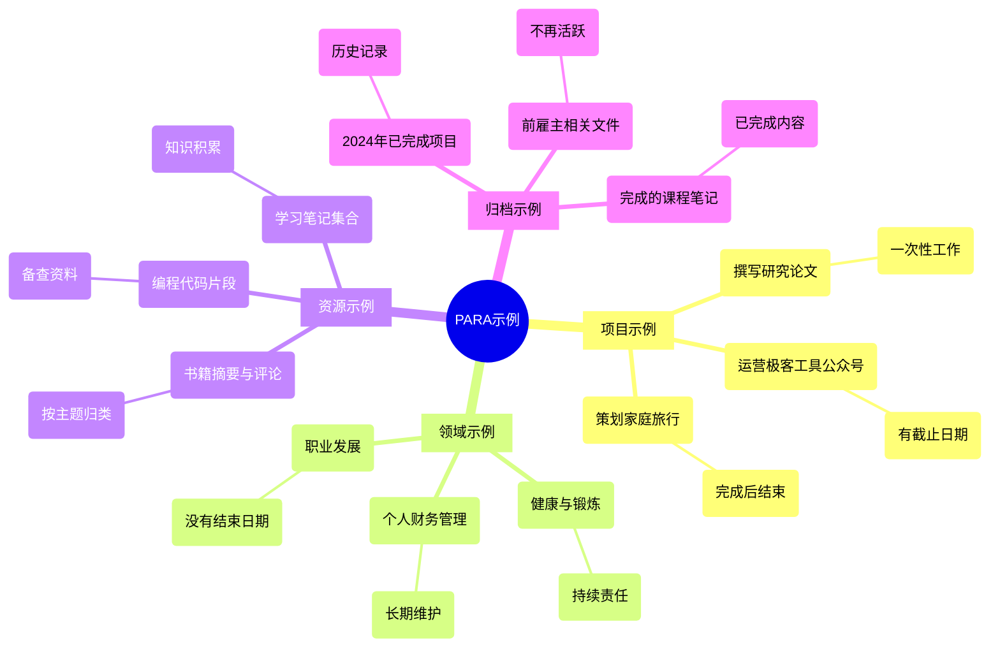

![[cover-pkm-method-basb.png]]

# 渐进式总结：构建流动生长的知识体系
在微信收藏夹堆满文章、手机相册存满截图、云笔记里躺着几百条未整理笔记的今天，我们早已不是 " 信息匮乏者 "。真正的挑战并不在于将内容从一个地方转移到另一个地方，而在于**将内容通过时间传递**。真正困扰我们的，是如何让这些沉睡的知识在需要时 " 活过来 "。

## 知识的真正困境：如何穿越时间

你是否有过这样的经历？读某本书时被某个观点击中，决心实践却无从下手；学习课程时记录的干货笔记，三个月后变成看不懂的 " 天书 "；收藏的深度好文，等到真正需要时却淹没在信息洪流中。

然而，问题可能并不在于我们获取的知识本身，而在于**我们获取知识的时间**。我们可能在错误的时间学习了某些知识，而这些知识在未来某个特定情境下才会真正发挥作用。因此，知识的挑战不在于获取，而在于**识别哪些知识值得获取**，并建立一个系统将这些知识**通过时间传递**到未来最需要它们的时刻。
这暴露了知识管理的本质矛盾：**我们总在错误的时间遇见正确的知识**。
就像在旱季储存雨水，却在雨季来临时找不到蓄水池。真正有效的知识系统，应该像智能物流网络，能把知识精准送达未来的 " 需求现场 "。

## PARA 系统：给知识装上时空导航

为了解决这一问题，`Tiago Forte` 提出了 `第二大脑` 的概念。第二大脑是一个外部的、集成的数字知识库，用于存储和检索我们学习的内容及其来源。它是一个存储和检索系统，将知识打包成离散的 `知识集合`，并能够在未来的某个时刻被重新审视、利用或删除。

Tiago Forte 提出的 [PARA 方法] 系统，本质上是在知识领域实践 `断舍离`：
PARA 系统将笔记根据其**可操作性**（而非其意义）进行分类，分为 4 个顶级类别：
1. **项目（Projects）**：手头正在推进的具体任务（如 " 设计 Q2 的技术方案 "）
2. **领域（Areas）**：需要持续关注的长期责任（如 "AI 工具体系 "、" 个人健康 "）
3. **资源（Resources）**：未来可能用到的知识储备（如 "AI 在知识管理上的应用案例 "）
4. **档案库（Archives）**：已完成事项的完整记录

这个系统的精妙之处在于**动态流动机制**：项目完成后的成果转化为领域经验，领域积累的素材沉淀为资源库，失效资源则归档为历史数据。就像长江水系，既有奔涌的干流（项目），也有支流（领域）和湖泊（资源），最终汇入大海（档案库）。

PARA 方法示例

## 渐进式总结：设计可发现的笔记

### 三种知识管理方式

在笔记管理领域，主要有三种思想流派：**标签优先**，**笔记本优先**和以**笔记优先**。
1. **标签优先**（tagging-first）的方法主张没有明确的笔记、笔记本和堆栈层次结构，
2. **笔记本优先**（notebook-first）的方法则将物理世界的组织方式引入数字世界。
3. **笔记优先**（note-first），将**单个笔记的设计**作为主要因素，兼容标签或笔记本。

#### 标签优先
![[1 A9MFYA0pXOWhCAYOAKcvqw.jpeg|标签优先]]

1. **标签优先的方法**认为不应该有明确的笔记、笔记本和堆栈的层次结构。
2. 笔记被设想为一个不断变化的、虚拟的、相互连接的、自由浮动的想法矩阵。
3. 因为一个笔记可以应用多个标签，所以有多种途径可以发现任何给定的笔记。
4. 将笔记定位在特定的笔记本和文件夹中被视为限制性和静态的。

尽管标签有其用途，但我不认为它们可以作为主要的组织系统。
标签很自由，可以很随意，根据我的经验，依赖标签太脆弱，需要太多的维护，用的不好会导致标签爆炸，带来混乱；
我们的大脑并不擅长处理如此抽象的概念，我们直观地、自动地理解将一件事放在一个地方。我们会控制不住的去给标签分组，去建立层级标签，建立标签去充当了笔记本/文件夹；
将注意力过于均匀地分散在所有笔记上，无论它们是否真正有价值，这总有点让人难以专注。

#### 笔记本优先
组织笔记的第二种传统方法是**笔记本优先**。这基本上将我们在物理世界中组织事物的方式——在一系列离散的容器中——转移到数字世界。

![[1 e8Axv4OKw5fra2uSx6xxQA.jpeg|笔记本优先]]

* 笔记本优先比标签优先更好，主要是因为它不碍事。它不试图自动化并侵犯深度直观的连接和模式识别行为。PARA 本身就是一个笔记本优先的系统。
* 如果我们止步于此，它仍然不足以应对基于创意产出的经济。正如标签爱好者正确指出的那样，笔记本和文件夹实际上抑制了创意生活方式核心的偶然性和随机性。

#### 笔记优先
于是 Forte 提出了一种打破僵局的方法：以**笔记优先**，将**单个笔记的设计**作为主要因素，而不是标签或笔记本。

![[1 fTOLyVYZPBoFlw-MEo4TPg.jpeg|笔记优先]]
这种方法具有以下优势：
* 与任何其他组织系统兼容（不限于标签和笔记本），但不依赖于它们。
* 使你在笔记上所做的所有工作都成为增值工作，因为你花费了近 100% 的时间直接与内容本身互动。
* 更容易在设备、存储位置甚至程序之间迁移，因为笔记内容比整体结构更有可能被保留。
* 培养有价值的技能，如简洁的沟通、找到核心思想、视觉思维等，这些技能本身就有价值，并且可以高度转移到其他活动中。
* 使你的笔记对他人更具可读性和实用性（与你的内部笔记本结构不同，后者仅供你使用），促进协作和共享。

通过以笔记为先的方法，你的笔记变得像单个**原子**——每个都有其独特的属性，但准备组装成**元素、分子和化合物**，这些元素、分子和化合物更强大。

### 设计可发现的笔记

在笔记优先的方法中，我们需要考虑设计。你实际上是在为一个苛刻的客户——未来的你——设计一个产品。未来的你并不信任过去你在笔记中放入的所有内容，因此你需要 " 推销 " 这些笔记，确保它们在未来的某个时刻能够被发现和使用。

在设计笔记时，我们需要平衡两个优先级：**可发现性**和**理解性**。

* **可发现性**涉及使笔记变得小巧、简单且易于消化。我们通过**压缩**来实现这一点，创建高度浓缩的摘要，去除所有冗余内容，结果可以是你能够想起一个 `关键词` 来找到它。
* **理解性**涉及包含所有**上下文**：细节、示例和引用来源，以确保没有任何遗漏。

### 压缩与上下文
!![[压缩知识与保留上下文的平衡.png|压缩知识与保留上下文的平衡]]
压缩和上下文之间存在天然的张力。为了传达任何信息，你必须对其进行压缩，但在这个过程中，你会失去许多使信息有价值的上下文。

如果压缩过度，笔记将失去其意义；如果包含过多上下文，笔记将失去其可发现性。因此，找到压缩与上下文之间的平衡至关重要。

### 渐进式总结的 5 个层次
![[渐进式总结的5个层次.png|渐进式总结的5个层次]]
渐进式总结通过 " 层次 " 来进行总结。
* ***第 1 层**是原始的、完整的源文本。
* **第 2 层**是初始导入到笔记程序中的内容，包括任何感觉有洞察力、有趣或有用的内容。
* **第 3 层**是第一次真正的总结，只加粗导入段落中最好的部分。
* **第 4 层**则进一步突出显示 " 精华中的精华 "。
* **第 5 层**是对第 2 层和第 3 层的非正式执行摘要，用我自己的话重新表述关键点。

最后，对于极少数特别有影响力的来源，我会进行**重新混合**，将其转化为其他形式，如博客文章、草图、幻灯片或短视频。

## 结语
渐进式总结是一种实用的技术，帮助我们将知识通过时间传递到未来最需要它们的时刻。通过设计可发现的笔记，我们能够更好地管理知识，确保其在未来的某个时刻能够被发现、理解并应用。

如果你对构建第二大脑感兴趣，可以参考 [《打造第二大脑-Building a Second Brain》](https://weread.qq.com/web/reader/f3032e10813ab88b1g011a36#outline?noScroll=1) 一书，学习如何组织你的数字生活并释放你的创造潜力。

在这个 `信息熵增` 的时代，`真正的知识管理不是对抗遗忘，而是设计生长`。
当你的知识体系具备生态系统的自我调节能力，每个信息碎片都将成为构建认知大厦的活性细胞。现在，是时候启动你的第二大脑进化程序了。
