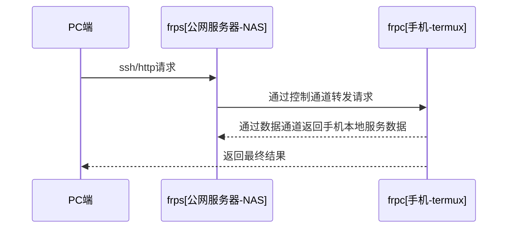

![[termux-frpc-image-20250306-2.png|893x502]]

# 使用 frp 实现任意地点远程控制 Android 手机
上次在 android 手机端的 [termux 配置 git](https://mp.weixin.qq.com/s/pbvLV6GQjeqPuSidE_i8zw)，手机在触屏上操作 cli 慢的要死，搞得我很晚回家在局域网才能弄，受不了这个效率。
今天搭了个 `frp`，彻底解决在任意地点，只要有网，都能 `ssh` 连自己手机的方案。过程以 `obsidian` 记录，分享给大家。

## frp 实现原理
项目地址： [frp](https://github.com/fatedier/frp)(fast reverse proxy),A fast reverse proxy to help you expose a local server behind a NAT or firewall to the internet.

实现原理



![[termux-frpc-image-20250306-1.png|645x327]]
实际就是内网穿透的原理，反向连接公网服务器，转发数据实现外网访问。

> 举个生活例子
  你让在国外的朋友帮你买个东西，你先打电话给中间商（公网服务器），中间商通知当地的朋友（手机客户端），朋友买到东西后通过物流（数据通道）寄回中间商，最后转交给你。

项目语言是 go 实现的，部署起来特别方便，我这儿 frps 使用 docker 部署，frpc 在客户端目前没有 docker 环境，下个二进制文件起来就行。

## frps 服务端部署

准备配置文件，注意老的是 ini，新版本都是 toml 格式了

```bash
mkdir -p /mnt/mind/data/frps
vim /mnt/mind/data/frps/frps.toml
```

`frps.toml`

```toml
[common]
bind_port = 17000
# frps的看板页
dashboard_port = 17500
dashboard_user = admin
dashboard_pwd = 12345678

# http proxy
vhost_http_port = 17080
vhost_https_port = 17081

# frpc客户端认证密码
token = 12345678
```

使用 docker 部署

```yml
version: '3'

services:
  frps:
    image: snowdreamtech/frps
    container_name: frps
    restart: always
    network_mode: host
    volumes:
      - "/mnt/mind/data/frps/frps.toml:/etc/frp/frps.toml"
```

dashboard 
* 地址：http://your.domain.org:17500
* 账号：admin/12345678
![[termux-frpc-image-20250306.png|893x329]]

## frpc 客户端配置
* 下载 frpc 客户据端：[frp_0.61.1_linux_arm64.tar.gz](https://github.com/fatedier/frp/releases/download/v0.61.1/frp_0.61.1_linux_arm64.tar.gz)，我是安卓手机，选 arm64 架构

准备 `frpc.toml`

```toml
[common]
# server_addr-->server的ip
server_addr = "your.domain.org"
# server_port-->server的bind_port
server_port = "17000"
# 身份验证
token = "12345678"

# [android] 为服务名称，下方此处设置为，访问frp服务段的18022端口时，等同于通过中转服务器访问127.0.0.1的8022端口。
[android]
type = tcp
local_ip = 127.0.0.1
local_port = 8022
remote_port = 18022
```

```bash
# 解压
mkdir ~/tool/
tar -xvf frp_0.61.1_android_arm64.tar.gz
# 准备配置文件
mv frp_0.61.1_android_arm64 frpc
~ $ tree ~/tool

%% /data/data/com.termux/files/home/tool
├── frp_0.61.1_linux_arm64.tar.gz
└── frpc
    ├── LICENSE
    ├── frpc
    ├── frpc.toml
    ├── frps
    └── frps.toml

 %%2 directories, 6 files

# 手动配置
vim  frpc/frpc.toml

# 启动服务
cd /data/data/com.termux/files/home/tool/frpc
nohup ./frpc -c frpc.toml > frpc.log &
tail -200f frpc.log
```

![[Screenshot_20250306_215946_com.termux.jpg]]

android 的 frpc 启动成功后，在 frps 服务端看到网络统计数据
![[Pasted image 20250306195621.png]]
OK，万事具备，frpc 和 frps 的通道已经建立。
现在，通过 ssh 连接 `frps` 服务器的 18022 端口，就能直接控制手机的 8022 端口了

```bash
ssh -p 18022 u0_a279@your.domain.org
```

📌 总结
本文介绍了 如何使用 `frp` 开源项目在任意地点远程控制 `android` 手机。

搞好了，全身愉快。明天开始 ssh 直接控制手机，传送文件，我就再也不用走微信文件/kodbox 之类的绕了。

至于 termux 跑大模型，搞 jupyterlab 玩开发之类的，暂时没有需求，如今通道有了，后面有想法再折腾。