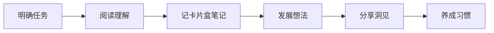

![[zettelkasten-image-20250226-1.png|1024x576]]

# 从碎片到体系：Obsidian 实践卡片笔记法的底层逻辑

德国学者 `卢曼` 是德国当代重要的社会学家，卢曼作为社会系统理论的创新者，被视为卓越的 `社会学` 大家，他的一生中一共出版了 70 多本书和 400 多篇学术著作。
2013 年，德国社会学家约施密特在做了大量研究后发现：[[卢曼教授]] 在不借助计算机的情况下拥有如此大的产出，完全归功于他自己总结的一套笔记管理方法，**Zettelkasten** 也被称为 `卡片盒笔记法` 或 `卡片笔记法`。

Obsidian 在实践个人知识库之前，**《卡片笔记写作法》** 这本书值得一读，有了底层逻辑才不会被 Obsidian 社区插件市场里五花八门的插件搞得不所适从。

卡片笔记法包含 4 个原则和 6 个步骤:

## 六个步骤

### 步骤说明

1. **明确任务**：全神贯注于每一项任务，减少做决定，写下来为大脑减负。👉🏿比如：决定今天要阅读一篇关于人工智能的文章
2. **阅读理解**：手中有笔，保持开放心态，写下来有助于真正理解。
3. **记卡片笔记**：坚持每天记几条笔记，将永久笔记添加到卡片盒里。
4. **发展想法**：构建主题，建立智能链接，将卡片盒作为思考的工具箱。👉🏿比如：基于笔记，构建 `人工智能应用` 主题，建立相关链接。
5. **分享洞见**：从头脑风暴到卡片盒风暴，在兴趣驱动下完成任务，完稿和修订。👉🏿比如：撰写一篇关于 `人工智能应用` 的文章，进行修订。
6. **养成习惯**：持续实践，形成稳定的写作习惯

## 4 个原则
1. **写作是唯一重要的事情**：反向提高阅读，思考能力，用自己的语言阐述
2. **简洁是最重要的**：笔记内容具备原子性，笔记分类保存并定时转化（闪念笔记 ->永久笔记<- 项目笔记）；
3. **没有人完全从零开始写作**：知识积累先行，笔记驱动思想发展，兴趣自然形成主题
4. **让工作推动你前进**：不依赖意志力，建立正向反馈循环（记永久笔记时发现矛盾/不一致/重复的地方）；

## 4 个原则与 6 个步骤的联系
这 4 个原则是 `卢曼卡片盒写作法` 的核心思想，贯穿于 6 个具体步骤中，指导每一步的实践。
以下是它们如何相互联系的详细说明，并附上举例：

### 1. 写作是唯一重要的事情
- **连接步骤**：这一步贯穿整个流程，尤其在 `阅读理解` 与 `记卡片盒笔记` 中体现。通过写作驱动阅读和思考，将输入的知识转化为自己的语言。
- **举例**：阅读一篇关于 `记忆力` 的文章时，`用自己的语言总结` 核心观点，并将其记录为永久笔记。

### 2. 简洁是最重要的
- **连接步骤**：这一原则主要体现在 `记卡片盒笔记` 和 `发展想法` 中。笔记需要 `简洁`、`独立`，并通过 `分类` 和 `链接` 形成知识网络。
- **举例**：将阅读时记录的 `短期记忆与长期记忆的区别` 整理为一条 `原子性` 的 `永久笔记`，并与相关主题（如 `学习方法`）建立链接。

### 3. 没有人完全从零开始写作
- **连接步骤**：这一原则在 `发展想法` 和 `分享你的洞见` 中尤为突出。写作是建立在已有笔记和知识网络的基础上，而非从空白开始。
- **举例**：撰写一篇关于 `如何提高记忆力` 的文章时，从卡片盒中提取与 `记忆原理`，`学习技巧` 相关的笔记，作为文章的基础素材。

### 4. 让工作推动你前进
- **连接步骤**：这一原则贯穿整个流程，尤其是在 `养成习惯` 和 `分享你的洞见` 中。通过持续记录和整理笔记，建立正向反馈，激发进一步学习和写作的动力。
- **举例**：在记笔记时发现 `记忆方法与创造力` 的联系，从而激发新的写作灵感，推动进一步研究和输出。

---

此刻某位社会学家的卡片盒正在黑洞里发光：看，这就是知识的复利公式→ 🧠+📝+🕰️=🚀