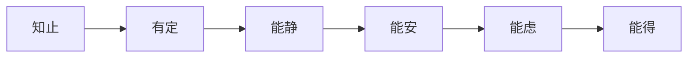
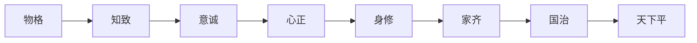
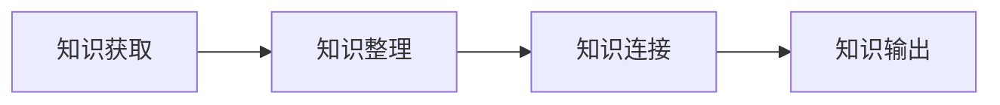
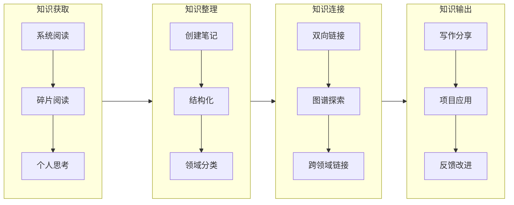
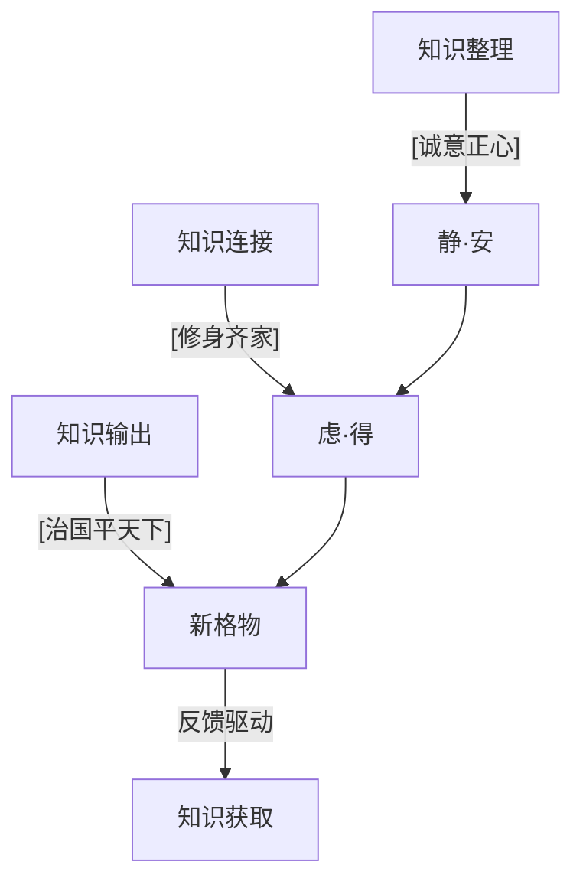

# 当 Obsidian 遇见大学之道：数字时代的格物致知法

本文以《大学》" 六境界 " 与 " 七证得 " 为哲学框架，构建了一套融合东方智慧与数字工具的知识管理流程。
通过格物（知识节点）→致知（知识连接）→诚意正心（知识整理）→修身齐家（知识输出）的闭环，结合 Obsidian、Miniflux 等工具链，实现从碎片化信息到系统性认知的升维，助力个人在信息爆炸时代完成 " 明明德于天下 " 的现代修行。

# 大学有言
大学里：做人有六境界，做事有七证得

> 大学 - 六境
>
> 知止而后有定，定而后能静，静而后能安，安而后能虑，虑而后能得。
> 物有本末，事有终始。
> 知所先后，则近道矣。

> 大学 - 七证
>
> 古之欲明明德于天下者，先治其国；欲治其国者，先齐其家；欲齐其家者，先修其身；欲修其身者，先正其心；欲正其心者，先诚其意；欲诚其意者，先致其知，致知在格物。物格而后知至，知至而后意诚，意诚而后心正，心正而后身修，身修而后家齐，家齐而后国治，国治而后天下平

在信息大爆炸的年代，如果将每个 `知识节点` 都视为格物致知的实践，知识管理就升维为 `明明德于天下` 的现代修行。

# 知识管理

> 主流程

> 流程节点

## 知识获取

1. 浏览器，打开 rss 订阅 -[[miniflux]] 阅读，使用 [[obsidian-web-clipper]] 插件高亮，收集到 [[obsidian]] 的未归档目录
2. 手机端：rss 客户端 [[fluent-reader]] 收藏到 [[miniflux]] 的服务器，使用 [[miniflux]] 的 api 将知识获取到 [[obsidian]] 的未归档目录

⚠️ 常见误区预警：
1. 过度格物：陷入 `知识松鼠症`（建议设置每日 1 小时信息摄入上限）
2. 强行连接：制造虚假关联（可用 [[正交性原则]] 校验）

## 知识整理
1. obsidian 的 [[quick add]] 插件开启 ai 助手，配置 [[deepseek]] 模型，对收集内容按模板结构化，然后快速阅读，获取关键信息
2. obsidian 的 [[copilot]] 插件配置 [[deepseek]] 模型，对辅助整理内容为卡片，分类打标；

整理本质是 信息断舍离，需用 " 诚意 " 破除三类妄念：
1. 去伪存真（校验信息来源可靠性，对应《大学》" 毋自欺 "）
2. 去冗存精（用 Deepseek 模型提炼核心，呼应 " 知止 " 境界）
3. 去碎存整（通过 Obsidian 模板强制结构化，实现 " 定而后能静 "）

## 知识连接
1. 手动建立连接：如果一个关键词都想不起来，说明知识太零碎，需要提高 `紧凑性`，如果关键词搜到的太多，说明没有做汇总，需要做好 `正交性`
2. 定期删除无实质意义的关联/节点

## 知识输出
1. 静态博客分享：将一些可以公开的笔记放到一个固定的目录，比如 blog，将 blog 软链接到 [[quartz]] 项目的 content 目录，使用 git 提交到 github，`github action` 自动编译静态博客；
2. 社交媒体分享：发布后的博客，可通过 rpa 脚本/工具，以 url 形式同步到其他社交平台；
3. 控制输出焦虑：质量＞频率

## 哲学闭环

每个输出成果都是新的 " 格物 " 起点，形成 " 得→知止→定…" 的新循环，完美演绎《大学》" 物有本末，事有终始 " 的螺旋认知模型。

📌 总结
如《大学》所言：" 知止定静安虑得 " 非线性阶梯，六境七证实为螺旋上升的修行。知识管理的终极目标，是让每个「格物」实践都成为「明明德」的修行道场。