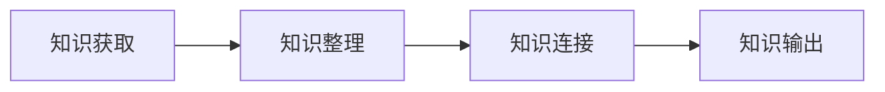
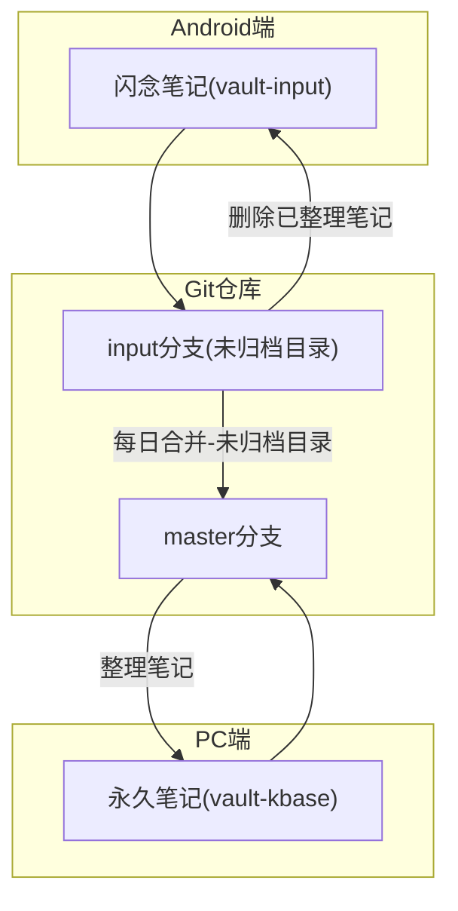

本文重点讲解知识获取阶段 - 如何使用 Obsidian 的双 Vault+ 双 Git 分支完成闪念笔记的同步。
开源工具 POC 了一圈，Notesnook、Anytype、Joplin、Notion、Flomo 等各有千秋，但最终还是 程序员最爱的 Git 胜出。

# 构建智能知识库 - 闪念笔记的同步流程
知识库建设分 4 个阶段（`知识获取`->知识整理 ->知识连接 ->知识输出）。

知识获取阶段，除了 `向外阅读学习`，还有一部分是 `观照内在的自我`，记录自己的奇思妙想、悲欢喜乐。

## 我的需求
1. 浏览器 - 稍后阅读：已经实现 - 参考 [[kbase-ingestion-reading|构建智能知识库：Obsidian Web Clipper 的 AI 自动化流程]]
2. 移动端 -idea 捕捉：能干净快速的输入，稍后在 obsidian pc 端再整理入库

## 开源工具
我目前在 obsidian 仓库内的文件太多，体验不好，会冲突，想着找一个笔记服务，能支持 `android` 端记录，支持端到端加密，且 obsidian 有插件能导入 android 的闪念笔记。

结果 POC 了一圈，以下工具都不满足我的需求

1. [notesnook](https://github.com/streetwriters/notesnook)：支持端到端加密，交互友好，2025-03-09 暂未支持 self-hosting sync server 还在开发中,保持关注
2. [anytype](https://github.com/anyproto/anytype-kotlin)：端到端加密，有一套自己的概念，有学习曲线，试了下 markdown 的导入支持很烂，还不成熟；
3. [joplin](https://joplinapp.org/help/install/): 官方同步支持的挺全，webdav,onedrive,nexcloud,s3,自建 joplinserver 都支持，but 他底层存储会对原始的 md 文件后面追加很多属性（比如笔记的时间，地理位置等 20 多个属性），这个不得不说 obsidian 设计的妙，用 yaml 头来支持自定义属性，不会硬改用户的文件；
4. [notion](https://www.notion.so/)：android 端依赖 google 框架，国内用不了；
5. [onenote](https://www.onenote.com/)：不支持端到端加密，国内不稳定，obsidian-importer 登录会卡在授权
6. [flomo](https://flomoapp.com/)：不支持端到端加密，数据 7 天才能在浏览器导出一次，不支持导出 API；数据发布的 API 需要升级 PRO 会员才能调用（99 元/年）
7. [SilentNotes](https://github.com/martinstoeckli/SilentNotes)：纯笔记客户端，支持各类在线网盘，webdav,ftp 同步；测试连接 http 时报无法连接到服务。
8. [obsidian-android](https://obsidian.md/mobile)：官方原生客户端，体验和 PC 端可保持高度一致。

## 当下方案
目前工作流程如下：

1. 在 obsidian 设置 2 个 vault，隔离永久笔记和临时笔记；
	1. valut-kbase：存储永久笔记，记录日常 GTD 的事物
	2. vault-input：存储临时笔记，浏览器采集的稍后阅读，obsidian-android 采集的闪念笔记
2. 在 obsidian 的 git 仓库设置为 2 个 分支；
	1. master 分支：对应 valut-kbase 永久笔记，pc 端使用
	2. input 分支：对应 valut-input 临时笔记，android 端
3. 每天在笔记本电脑上，将 input 分支的 `未归档` 目录 merge 到 master 分支，然后整理笔记。
4. 删除 input 分支 zzz 目录已整理的笔记；

程序员最理想的同步工具还是 `git`，日常工作天天用够熟悉够可控，再配合之前搞定的一些问题：
* [Obsidian 多端同步 - Git](https://mp.weixin.qq.com/s/JOy_hmy1dIKd2C6U4joz4Q)
* [使用 frp 实现任意地点远程控制 Android 手机](https://mp.weixin.qq.com/s/KpjEaRO8dTRBksOsAwJpSw)
* [构建智能知识库 - 知识获取：Obsidian Web Clipper 的 AI 自动化流程](https://mp.weixin.qq.com/s/t3ixBcbJl-FqVMFsZ4GVkA)

公众号很多小伙伴反馈说 `微力` 好用，今天 `木溪` 也反馈说 `syncthing` 一直用的很好，心痒想试试，可惜暂时没精力再搞这个事情了。
2025 年的数据采集和同步的工具就研究到这了，用一年看看哪儿不顺，后面再复盘折腾。
后面我还得花时间去研究知识生产工具，花精力去做知识整理，去实践卡片笔记。
