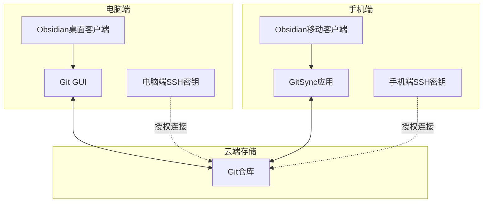
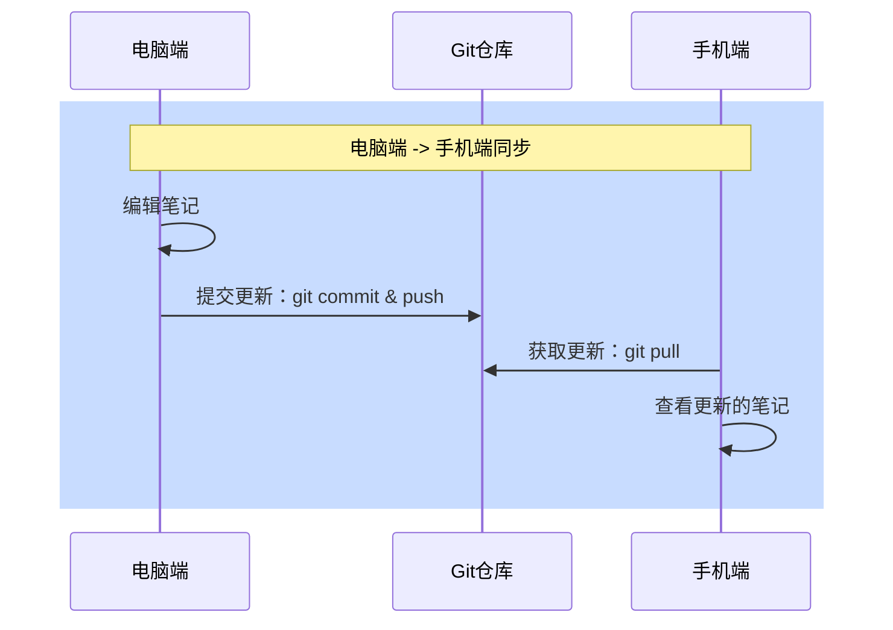
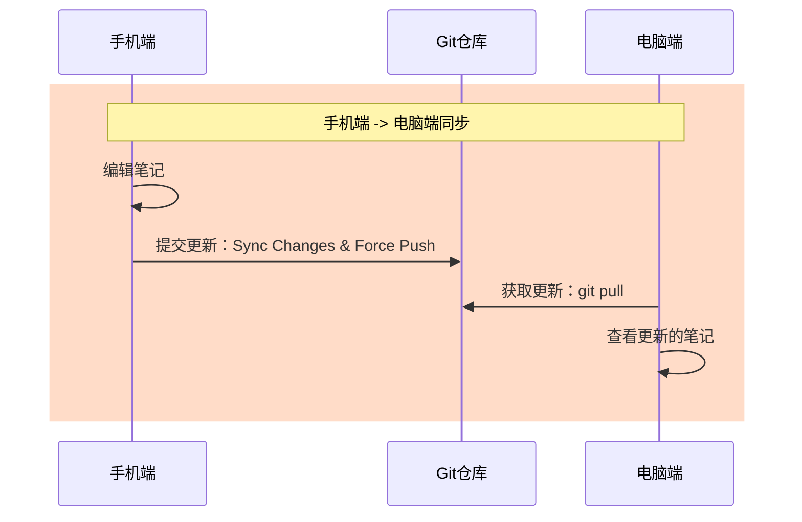

本文面向非技术 Obsidian 用户，剖析常见方案痛点，提出 "Obsidian＋Git" 多端同步：电脑与手机配置 SSH 密钥与插件，借助 Gitee 仓库自动拉取与推送，支持版本快照、冲突提示与回滚，并以双库结构优化采集与归档。

# 零门槛实现 Obsidian 多端实时同步：非开发人士也能轻松上手
在本地化笔记与多端实时同步的场景中，许多人会期望 " 一个库走天下 "，但在实践中往往遇到稳定性、冲突解决等问题。下面，我将以我的实践历程为例，带您循序渐进地了解如何设计一套可靠的 Obsidian 同步方案。

## 同步场景
- **客户端**：电脑端、手机端
- **笔记存储**：Obsidian 本地 Vault

## 同步需求
1. 手机端能随时记录闪念，并同步到服务器
2. 电脑端能及时获取手机更新
3. 发生冲突时，能及时提示并友好解决
4. 同步故障时，可快速回滚到上一个稳定版本
5. 同步服务性能稳定，不占用过多手机资源

## 方案尝试与痛点
由于使用过 Evernote,Flomo,OneNote,Notion 之类的商业笔记软件，所以在切换到 Obsidian 本地化笔记的时候，以为多端同步也是理所当然。然后开始了自己的同步方案的折腾：

### Syncthing
- **思路**：基于 P2P 自动同步,不需要同步服务器
- **痛点**：在 NAS 和公司网络环境下，连接不稳定，经常掉线

### WebDAV + Autosync
- **思路**：PC 上传至 NAS WebDAV，手机通过 Autosync 下载
- **痛点**：WebDAV 速度慢且不稳定，断点续传体验差

### CouchDB + Livesync
- **思路**：自行搭建 CouchDB 服务，借助 Livesync 插件同步
- **痛点**：大库同步时数据易损坏，恢复耗时且易出错

### Git + MGit
- **思路**：使用 Git 版本控制，手机端用 MGit 同步
- **痛点**：MGit 不稳定，常挂起，无法持续同步

### Git + Termux
- **思路**：同样基于 Git，手机端在 Termux 中手动执行
- **痛点**：手动操作灵活，但交互不友好，记录好后提交同步比较麻烦；

## 反思与现状
曾经设想 `一次编辑，实时同步`，却忽略了网络环境、冲突解决和客户端体验的复杂性。
目前，我依旧采用 Git 作为同步方案，但是手机端我引入了交互更好的同步 App，不需要手动执行同步脚本；采用目录隔离的方式减少冲突，并在多端编辑时，优先保留服务端最新版本，确保在出现问题时能够快速回滚。

## 当下的同步方案

我当下的同步方案，是为了给我不懂技术的媳妇和姐姐制作的，这次不需要会写代码，按流程配置好一次，即可实现一个稳定可靠的同步方案

## 为什么选择 Git 作为同步方式
因为 Git 比多数 p2p 工具（如 Syncthing）更稳定、更透明，且支持完整版本管理。

- **更安心**：每次笔记更新都会生成一份历史快照，想回退随时回退，不怕误操作。
- **更自由**：数据掌握在自己手里，不依赖第三方服务器，跨设备自由同步。
- **更耐用**：Git 是全球开发者用来管理代码的标准工具，成熟稳定，长期可用。
- **更省心**：一次配置，长期使用。无局域网限制，外网同步更简单。

👉 相比 Syncthing 这类局域网同步工具，**Git 不挑网络环境，版本恢复也更专业**。
👉 相比传统云盘，**Git 免费、轻量、不锁死格式，数据更安全**。

## 环境准备
## 手机端
1. GitSync 客户端： https://gitsync.viscouspotenti.al
2. Obsidian 客户端: https://obsidian.md/download

gitSync 安卓端是目前为止，我测试过的唯一稳定可用的开源 app。

![[零门槛实现 Obsidian 多端实时同步：非开发人士也能轻松上手-image-20250429.png|598x1248]]

### 电脑端
1. windows-git gui: https://git-scm.com/downloads/win
2. obsidian 客户端: https://obsidian.md/download

### Git 同步服务
因为媳妇没有 github 之类外网平台的帐号，为避免注册，使用 `微信` 授权即可登录。

- 登录 git 云服务: https://gitee.com/
- 初始化 `note` 项目
- 配置安卓端 publicKey，电脑端 publicKey

git 平台一般都支持 5G 左右的免费空间，够普通用户使用很多年；
而且配置好密钥后，后续可不再登录这个 git 平台，当他不存在；

## 配置流程
1. 安卓端：
	1. ssh 密钥准备：publicKey,privateKey
	2. git 项目配置
2. 电脑端
	1. ssh 密钥准备：publicKey,privateKey
	2. obsidian：安装 obsidian-git 插件

## 同步流程
### 电脑端 ->安卓端

- 电脑端编辑笔记
- 电脑端提交到 Git 仓库
- 手机端拉取更新
- 手机端查看笔记

### 手机端 ->电脑端

- 手机端编辑笔记
- 手机端同步到 Git 仓库（强制推送）
- 电脑端拉取更新
- 电脑端查看笔记

## 实践建议
使用 2 个 vault 管理知识:
1. 主 vault（**vault-kbase**）：用于个人知识库存储，使用 `PARA` 方法论组织目录；
2. 手机同步 vault（**vault-mobile**）：用于手机端闪念采集，稍后阅读，剪藏，库小轻量；定期整理归档到 **kbase** 库

## 结语
通过 "Git + Obsidian" 的方案，您不仅能拥有媲美商业云笔记的多端实时同步功能，更可享受版本管理带来的安全感与自由度。
1. 一次性完成 SSH 钥匙与 Obsidian 插件的配置后，无需手动干预即可自动同步更新；
2. 即便网络不佳或操作失误，也能凭借 Git 历史快照迅速回滚，真正实现 " 无痛同步，可靠备份 "。

为此，我制作了懒人开箱即用的 obsidian 模板，里面已经包含上面列举的电脑端和手机端的安装包，
github 项目地址，欢迎 star
https://github.com/geosmart/obsidian-template

访问不了的，使用国内项目地址：
https://gitee.com/geosmart/obsidian-template

遇到问题的，可以在公众号留言，或者在项目提 issue
